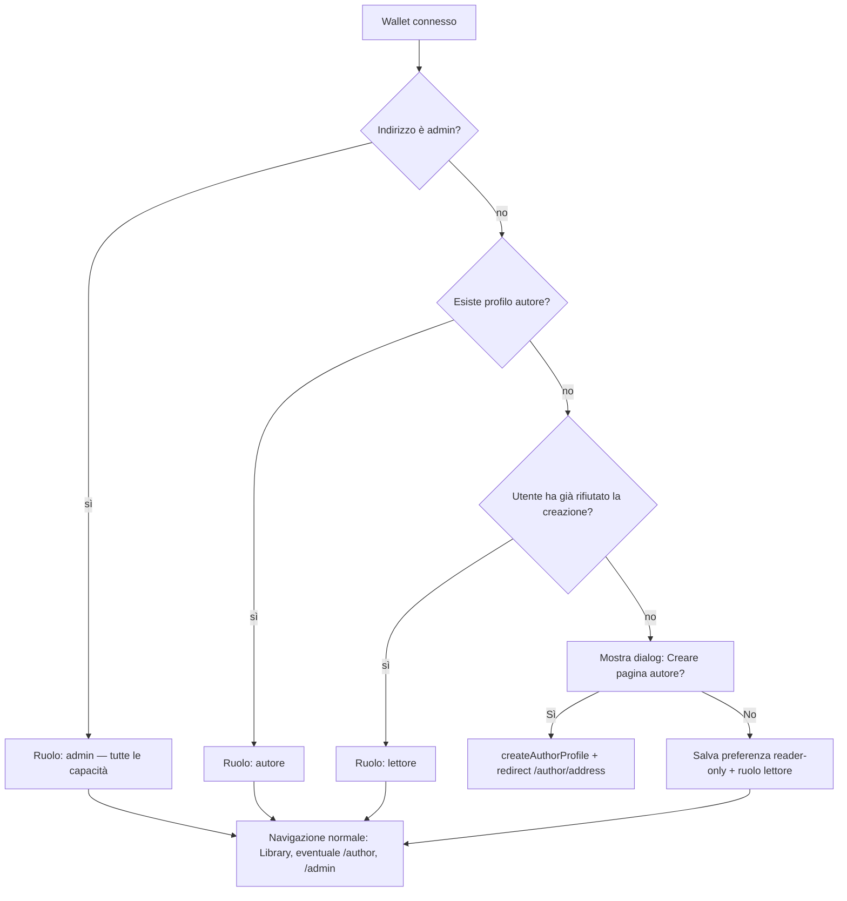

# Piano: pagina autore

Implementazione incrementale della pagina autore nel frontend (`apps/web`). Ogni punto corrisponde a **un commit** (o a una PR piccola). L’integrazione con un database reale è **fuori scope** in questa fase: si usa un layer mock con persistenza locale (es. `localStorage`) per simulare lettura/scrittura del profilo e le preferenze utente.

## Obiettivo

- Pagina pubblica autore: nome, immagine profilo (placeholder iniziale), chiave pubblica blockchain sotto il nome.
- **Tre livelli utente** (capacità cumulative):
  - **Lettore** — consulta contenuti e pagine autore in sola lettura.
  - **Autore** — lettore + pagina autore propria in editing.
  - **Admin** — lettore + autore + editing su **qualsiasi** pagina autore + area `/admin`.
- Al **login** (connessione wallet): verificare se esiste una pagina autore per quell’indirizzo; se no, chiedere se crearla; se l’utente rifiuta, resta in **modalità lettore** (nessun redirect forzato alla pagina autore).
- Mock al posto del DB fino a un secondo step.

---

## Ruoli e permessi

| Ruolo | Come si ottiene | Lettura | Pagina autore propria | Edit pagina autore altrui | Area `/admin` |
| --- | --- | :---: | :---: | :---: | :---: |
| **Lettore** | Wallet connesso, nessun profilo autore (o ha rifiutato la creazione) | ✓ | — | — | — |
| **Autore** | Wallet connesso + profilo autore creato | ✓ | ✓ (edit) | — | — |
| **Admin** | Wallet in `NEXT_PUBLIC_ADMIN_ADDRESSES` (già usato da `AdminGate`) | ✓ | ✓* | ✓ | ✓ |

\* L’admin ha sempre le capacità di un autore (può creare la propria pagina autore con lo stesso flusso onboarding). In più può modificare qualsiasi profilo esistente.

### Regole di editing sulla pagina `/author/[address]`

```ts
canEditAuthorPage(viewerAddress, profileAddress, isAdmin): boolean
// true se viewerAddress === profileAddress (proprietario)
//   oppure isAdmin (wallet nella lista admin)
```

La vista pubblica resta disponibile a tutti (connessi o meno) per indirizzi con profilo esistente.

### Riconoscimento admin

Riutilizzare la stessa env di oggi:

- `NEXT_PUBLIC_ADMIN_ADDRESSES` — lista separata da virgola (vedi [`AdminGate.tsx`](../../apps/web/src/components/AdminGate.tsx)).
- Estrarre la logica in `lib/auth/admin.ts` (es. `isAdminAddress(address)`) per evitare duplicazione tra `AdminGate` e pagina autore.

---

## Flusso post-login (onboarding autore)



**Trigger UI:** al primo `isConnected` dopo connect (o al mount dell’app con wallet già connesso), eseguire il controllo una volta per sessione — es. provider `UserRoleProvider` o hook `useAuthorOnboarding` nel layout root / `Providers`.

**Persistenza mock (preferenza lettore):**

```ts
type WalletPreferences = {
  declinedAuthorPage: boolean;  // true = non chiedere più, modalità lettore
};
```

Chiave `localStorage` es. `andromeda:wallet-prefs:{address}`.

---

## Modello dati (mock)

```ts
type AuthorProfile = {
  address: string;           // chiave pubblica (wallet), lowercase
  displayName: string;
  avatarUrl: string | null;  // null → placeholder
  createdAt: string;         // ISO — profilo creato esplicitamente, non “default”
};
```

**Importante:** un indirizzo **senza** record nel mock **non** ha pagina autore. Non generare profili fantasma per ogni `0x…` visitato.

| Funzione mock | Comportamento |
| --- | --- |
| `getAuthorByAddress` | `AuthorProfile \| null` |
| `hasAuthorProfile(address)` | `boolean` |
| `createAuthorProfile(address, partial?)` | crea profilo minimo (nome default abbreviato, avatar null) |
| `upsertAuthor(profile)` | update (proprietario o admin) |
| `getWalletPreferences` / `setWalletPreferences` | preferenza `declinedAuthorPage` |

Placeholder avatar: `public/placeholders/author-avatar.svg` o componente con iniziali.

---

## Routing

| URL | Comportamento |
| --- | --- |
| `/author/[address]` | Se profilo **esiste**: vista pubblica; editing se visitatore è proprietario **o** admin. Se profilo **non esiste**: messaggio “Pagina autore non trovata” (404 soft). |
| `/author` | Wallet connesso + profilo → redirect `/author/[address]`. Wallet connesso + no profilo + non ha rifiutato → onboarding (dialog). Wallet connesso + lettore (rifiutato) → messaggio + link Library. Non connesso → CTA `WalletButton`. |

La modalità editing **non** usa route separate: stessa URL, permessi da `canEditAuthorPage`.

---

## Architettura componenti

```
apps/web/src/
  lib/auth/
    admin.ts                 # isAdminAddress (condiviso con AdminGate)
    roles.ts                 # getUserRole, canEditAuthorPage
  lib/authors/
    types.ts
    mock-store.ts
  components/author/
    AuthorAvatar.tsx
    AuthorProfileView.tsx
    AuthorProfileEditor.tsx
    AuthorPageClient.tsx     # view vs edit (owner | admin)
    CreateAuthorPrompt.tsx   # dialog onboarding
  components/auth/
    AuthorOnboarding.tsx     # wrapper post-connect (opzionale nel layout)
  app/author/
    page.tsx
    [address]/page.tsx
```

---

## Step 1 — Tipi, mock store e preferenze wallet

**Commit:** `feat(web): add author profile types and mock store`

- `lib/authors/types.ts`: `AuthorProfile`, `WalletPreferences`.
- `lib/authors/mock-store.ts`: CRUD profili + prefs; **nessun** profilo auto-generato alla lettura.
- `hasAuthorProfile`, `createAuthorProfile`, `getAuthorByAddress`, `upsertAuthor`, prefs lettore.

**Definition of done:** si può creare un profilo su richiesta e salvare “non voglio pagina autore” per un indirizzo.

---

## Step 2 — Ruoli, admin condiviso e permessi edit

**Commit:** `feat(web): add user roles and author page edit permissions`

- `lib/auth/admin.ts`: `isAdminAddress` estratto da env.
- Refactor minimo `AdminGate` per usare `isAdminAddress`.
- `lib/auth/roles.ts`:
  - `getUserRole({ address, isConnected, hasAuthorProfile, isAdmin })` → `'admin' | 'author' | 'reader'`;
  - `canEditAuthorPage(viewer, profileOwner, isAdmin)`.
- Regola: admin è sempre trattato come ruolo `admin` (include capacità autore+lettore anche senza profilo proprio).

**Definition of done:** funzioni testabili che riflettono la tabella ruoli sopra.

---

## Step 3 — Asset placeholder e componente avatar

**Commit:** `feat(web): add author avatar placeholder component`

- Placeholder in `public/placeholders/author-avatar.svg`.
- `AuthorAvatar`: `avatarUrl` o fallback.

**Definition of done:** componente riusabile indipendente dalla pagina.

---

## Step 4 — Vista pubblica del profilo

**Commit:** `feat(web): add read-only author profile view`

- `AuthorProfileView`: avatar, `displayName`, indirizzo blockchain completo sotto il nome (`font-mono`, `break-all`).
- Badge opzionale “Admin view” quando l’editor è admin ma non proprietario (solo in edit, vedi step 6).

**Definition of done:** layout read-only coerente con il resto dell’app.

---

## Step 5 — Route `/author/[address]`

**Commit:** `feat(web): add public author page route`

- Caricamento profilo: se `null` → UI “Pagina autore non trovata”.
- Se esiste → `AuthorProfileView` (sola lettura fino allo step 6).

**Definition of done:** URL valida mostra profilo solo se creato; altrimenti messaggio chiaro.

---

## Step 6 — Editing: proprietario e admin

**Commit:** `feat(web): allow author and admin to edit author profiles`

- `AuthorProfileEditor`: nome + upload immagine (mock, data URL / blob).
- `AuthorPageClient`:
  - `canEditAuthorPage` → editor;
  - altrimenti `AuthorProfileView`.
- Admin su pagina altrui: stesso editor, etichetta tipo “Modifica come amministratore”.
- Salvataggio: `upsertAuthor` (in futuro: verifica firma lato server).

**Definition of done:** proprietario e admin modificano nome/avatar; gli altri vedono solo lettura.

---

## Step 7 — Onboarding: creazione pagina autore o modalità lettore

**Commit:** `feat(web): prompt author page creation on wallet connect`

- `CreateAuthorPrompt`: dialog/modal “Vuoi creare la tua pagina autore?” — Sì / No.
  - **Sì** → `createAuthorProfile` → redirect `/author/[address]`.
  - **No** → `declinedAuthorPage: true` → resta lettore, nessun redirect automatico.
- `AuthorOnboarding` nel tree client (es. sotto `Providers`): esegue controllo a connect; non mostrare se admin senza profilo? **Sì, mostrare anche all’admin** se non ha ancora profilo (può crearlo o rifiutare e usare solo edit altrui + `/admin`).
- Non ripresentare il dialog se `declinedAuthorPage` o profilo già esiste.

**Definition of done:** primo login chiede creazione pagina; rifiuto → esperienza lettore senza nag ripetuto.

---

## Step 8 — Route `/author` e navigazione per ruolo

**Commit:** `feat(web): wire /author route and role-aware navigation`

- `/author`: comportamenti descritti in tabella routing.
- `SiteHeader`:
  - tutti: Library;
  - lettore connesso: solo Library (+ wallet);
  - autore: link “La mia pagina” → `/author`;
  - admin: + link Admin (esistente) + opzionale “La mia pagina” se ha profilo.
- Evitare link “La mia pagina” per lettori che hanno rifiutato la creazione.

**Definition of done:** navigazione riflette i tre ruoli; `/author` rispetta onboarding e redirect.

---

## Step 9 — Pulizia e documentazione

**Commit:** `docs: document author page roles and mock limitations`

- Nota mock + `localStorage` + limiti (prefs solo per browser).
- Step futuro DB: tabella `authors`, tabella `wallet_preferences`, autorizzazione PATCH (owner signature o admin allowlist server-side).

**Definition of done:** documentazione allineata a ruoli e flusso onboarding.

**Implemented**

- README: [Author pages (mock implementation)](../../README.md#author-pages-mock-implementation)
- Code reference: `apps/web/src/lib/authors/mock-limitations.ts`, `storage-keys.ts` (unit tested)

---

## Step futuro (non in questi commit) — Database

- `authors`: profilo come sopra.
- `wallet_preferences`: `declined_author_page`, eventuale `onboarding_completed_at`.
- Server: `GET /authors/:address` (pubblico se esiste), `POST /authors` (creazione con firma wallet), `PATCH /authors/:address` (owner o admin verificato server-side).
- Sostituire mock mantenendo `roles.ts` e componenti UI.

---

## Criteri di accettazione (riepilogo)

1. Pagina autore pubblica: **nome**, **avatar** (placeholder se assente), **indirizzo blockchain** sotto il nome — solo se il profilo **esiste**.
2. **Proprietario** del profilo: editing nome e immagine.
3. **Admin** (wallet in `NEXT_PUBLIC_ADMIN_ADDRESSES`): editing su **qualsiasi** pagina autore esistente + accesso `/admin` + capacità lettore.
4. **Login senza profilo**: dialog creazione pagina; se rifiutato → **solo lettore**, senza pagina autore associata.
5. **Login con profilo**: ruolo autore (o admin con profilo); accesso a `/author` proprio.
6. Persistenza mock in `localStorage`; nessun backend in questa iterazione.
7. Stile coerente con Andromeda.

---

## Ordine suggerito dei commit

```
1 → 2 → 3 → 4 → 5 → 6 → 7 → 8 → 9
```

- **Step 2** va prima dell’editing (6) e dell’onboarding (7).
- **Step 7** dipende da step 1 (create + prefs) e conviene dopo la route (5).
- Gli step 3–4–5 possono essere accorpati in un commit se si preferisce meno granularità.
