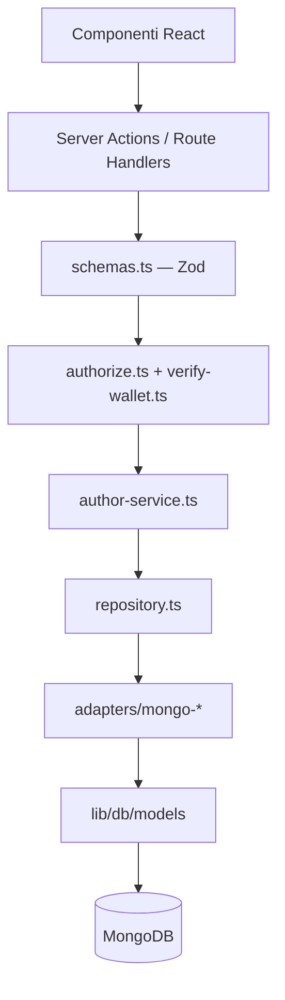

# Piano: integrazione database (layer ORM / ODM)

Implementazione incrementale del layer di persistenza per `apps/web`, con sostituzione graduale del mock `localStorage` descritto in [author-page.md](./author-page.md). Ogni punto corrisponde a **un commit** (o a una PR piccola).

## Obiettivo

Introdurre un **layer di persistenza** che:

1. **Espone un'astrazione** — il dominio (`lib/authors/*`, API, Server Actions) manipola profili e preferenze senza conoscere MongoDB.
2. **Gestisce il mapping** — schemi ODM traducono documenti MongoDB ↔ tipi di dominio (`AuthorProfile`, `WalletPreferences`).
3. **Isola la persistenza** — accesso ai dati confinato in `lib/db/*` e adapter repository; nessuna query nei componenti React.

**Scope di questa iterazione:** driver **MongoDB** soltanto. Il mock browser resta finché gli adapter MongoDB, l’**autorizzazione server-side** e le API non sono pronti e collegati.

**Fuori scope (step successivi):** upload avatar su IPFS, migrazione dati da `localStorage` esistente, SIWE con sessione persistente a lungo termine.

---

## Audit di sicurezza

Analisi del piano originale rispetto al passaggio da mock client-side a persistenza server condivisa.

### Threat model (sintesi)

| Attore | Capacità attuale (mock) | Rischio dopo DB senza mitigazioni |
| --- | --- | --- |
| Utente anonimo | Modifica solo il proprio `localStorage` | **Modifica/creates profili e preferenze di qualsiasi wallet** via HTTP |
| Utente malintenzionato | Limitato al proprio browser | **Profile squatting**, spam, DoS su MongoDB, stored payload in `avatarUrl` |
| Admin (client) | `isAdmin` valutato solo in UI | **Escalation**: chiunque può chiamare PATCH come admin se il server non verifica |

### Criticità individuate

| ID | Gravità | Vulnerabilità | Impatto |
| --- | --- | --- | --- |
| **S-01** | **Critica** | Mutazioni (`POST`/`PATCH`/`PUT`) senza prova di possesso del wallet | Creazione o modifica arbitraria di pagine autore; takeover di identità on-chain |
| **S-02** | **Critica** | Autorizzazione admin solo lato client (`NEXT_PUBLIC_ADMIN_ADDRESSES`) | Bypass UI: API dirette senza controllo server su edit altrui |
| **S-03** | **Alta** | Doppia superficie di attacco (Route Handlers + Server Actions) senza guard condiviso | Duplicazione logica, rischio di dimenticare auth su un percorso |
| **S-04** | **Alta** | `avatarUrl` accettato senza validazione server (data URL, URL esterni, SVG) | DoS (documenti enormi), stored XSS / `javascript:` in ``, tracking via URL esterni |
| **S-05** | **Alta** | `displayName` senza limiti di lunghezza/charset | DoS, UI break, potenziale XSS se reso in contesti non escapati |
| **S-06** | **Media** | Nessun rate limiting sulle mutazioni | Brute force, spam profili, esaurimento connessioni MongoDB |
| **S-07** | **Media** | `GET` preferenze wallet esposto pubblicamente | Information disclosure (`declinedAuthorPage` enumerabile) |
| **S-08** | **Media** | Utente MongoDB con privilegi eccessivi (`dbAdmin` in setup locale copiato in prod) | Compromissione credenziali DB → controllo cluster |
| **S-09** | **Bassa** | `MONGODB_URI` con TLS/auth non documentati per produzione | Sniffing credenziali, connessioni non cifrate |
| **S-10** | **Bassa** | Errori MongoDB/Mongoose non gestiti uniformemente | Information disclosure (dettagli stack o query in risposta API) |

### Decisioni di mitigazione (incorporate nel piano)

1. **Nessuna mutazione esposta in produzione senza verifica firma wallet** (viem `verifyMessage` — già in stack).
2. **Guard di autorizzazione unico** (`lib/authors/authorize.ts`) usato da Route Handlers e Server Actions.
3. **Validazione input con Zod** (pattern comune Next.js) prima del service layer.
4. **`avatarUrl`**: solo `data:image/png|jpeg|webp` entro 500 KB **oppure** `null`; rifiutare URL arbitrari fino a IPFS.
5. **Preferenze wallet**: lettura/scrittura solo per il wallet firmante; niente endpoint pubblico `GET`.
6. **Deploy bloccato** finché S-01 e S-02 non sono risolti (criterio di accettazione esplicito).

---

## Requisiti di sicurezza obbligatori

Da applicare in **ogni** step che espone mutazioni (step 8–10). Non opzionali.

### Autorizzazione server-side

```ts
// lib/authors/authorize.ts — regole minime
canCreateAuthorProfile(signerAddress, targetAddress): boolean
  // signer === target; entrambi normalizzati lowercase

canUpdateAuthorProfile(signerAddress, targetAddress, isAdmin): boolean
  // signer === target OR isAdminAddress(signer) — admin verificato server-side

canManageWalletPreferences(signerAddress, targetAddress): boolean
  // signer === target
```

Ogni mutazione richiede nel payload (o header):

- `address` — wallet dichiarato
- `message` — testo firmato con nonce e scadenza (es. 5 min)
- `signature` — firma EIP-191

Verifica con `viem` `verifyMessage`; **non fidarsi** dell’indirizzo wagmi lato client senza firma.

### Validazione input (Zod)

| Campo | Regole |
| --- | --- |
| `address` | `0x` + 40 hex, normalizzato lowercase |
| `displayName` | stringa 1–64 caratteri, trim, no byte di controllo |
| `avatarUrl` | `null` oppure data URL immagine ammessa, max 500 KB encoded |
| `declinedAuthorPage` | boolean |

### MongoDB (operazioni)

| Ambiente | Requisito |
| --- | --- |
| **Locale** | utente dedicato `andromeda` con `readWrite` su DB `andromeda` (ok per dev) |
| **Produzione** | utente app **solo** `readWrite` sul DB applicativo; **no** `dbAdmin`; TLS abilitato; IP allowlist o VPC |

### API e errori

- Risposte errore generiche al client (`401`, `403`, `404`, `409`, `422`); log dettagliati solo server-side.
- Nessun echo di `MONGODB_URI`, stack trace o errori driver in JSON di risposta.
- Rate limiting su `POST`/`PATCH`/`PUT` (middleware Next.js o piattaforma deploy).

---

## Scelta tecnologica

| Opzione | Decisione |
| --- | --- |
| **Mongoose** (ODM ufficiale de facto per MongoDB + Node.js) | **Adottato** — schema, mapping, validazione, indici; pattern documentato per [Next.js + MongoDB](https://www.mongodb.com/docs/drivers/node/current/integrations/nextjs/) |
| Driver `mongodb` nativo | Troppo basso livello — richiederebbe mapping e astrazione custom |
| Prisma | Supporto MongoDB possibile, ma meno idiomatico per document store; non necessario qui |
| ORM custom | Escluso per richiesta esplicita |
| **Zod** | **Adottato** per validazione input API/Actions (ecosistema Next.js) |

Mongoose copre il ruolo “ORM” in un contesto MongoDB (ODM). Il codice applicativo dipenderà da **interfacce repository**, non da `mongoose` direttamente.

---

## Ambiente e configurazione

Già impostato (vedi README e `apps/web/.env*`):

| Variabile | Uso |
| --- | --- |
| `MONGODB_URI` | Connection string server-only (`.env.development.local` in locale, Vercel in produzione) |

Next.js carica `MONGODB_URI` solo lato server (Route Handlers, Server Components, Server Actions). **Mai** prefissare con `NEXT_PUBLIC_`.

---

## Modello dati (collezioni MongoDB)

Allineato a `FUTURE_DATABASE_MIGRATION` in [`mock-limitations.ts`](../../apps/web/src/lib/authors/mock-limitations.ts):

### `authors`

| Campo (dominio) | Campo (MongoDB) | Note |
| --- | --- | --- |
| `address` | `address` | `string`, lowercase, **unique** |
| `displayName` | `displayName` | `string`, required, max 64 |
| `avatarUrl` | `avatarUrl` | `string \| null`, validato server-side |
| `createdAt` | `createdAt` | `Date` (ISO in dominio) |
| — | `updatedAt` | `Date`, gestito da Mongoose `timestamps` |

### `wallet_preferences`

| Campo (dominio) | Campo (MongoDB) | Note |
| --- | --- | --- |
| `address` | `address` | `string`, lowercase, **unique** |
| `declinedAuthorPage` | `declinedAuthorPage` | `boolean` |
| — | `onboardingCompletedAt` | `Date \| null`, opzionale |

**Regola invariante** (come il mock): un indirizzo **senza** documento in `authors` **non** ha pagina autore.

---

## Architettura a strati

```
apps/web/src/
  lib/
    auth/
      verify-wallet.ts            # verifyMessage (viem), nonce/expiry
    db/
      mongodb.ts
      models/
        author.model.ts
        wallet-preferences.model.ts
    authors/
      types.ts
      errors.ts
      schemas.ts                  # Zod — input API/Actions
      authorize.ts                # regole S-01, S-02 (server-only)
      repository.ts
      author-service.ts
      adapters/
        mongo-author-repository.ts
        mongo-wallet-preferences-repository.ts
      mock-store.ts               # da rimuovere nello step finale
  app/
    api/
      authors/
        route.ts                  # POST (auth)
        [address]/
          route.ts                # GET pubblico; PATCH (auth)
      wallet-preferences/
        [address]/
          route.ts                # PUT/PATCH (auth) — no GET pubblico
    actions/
      authors.ts                  # Server Actions — stesso guard delle API
```

### Flusso delle dipendenze



- **Dominio** (`author-service`, `types`, `errors`): nessun import di `mongoose`.
- **ODM** (`lib/db/models`): solo mapping e definizione schema.
- **Adapter**: implementa le port e traduce documenti ↔ dominio.
- **Auth + validazione**: obbligatorie **prima** del service su ogni mutazione.

---

## Contratto repository (port)

Interfacce in `lib/authors/repository.ts`, speculari al mock attuale:

```ts
// AuthorRepository
getByAddress(address: string): Promise<AuthorProfile | null>
exists(address: string): Promise<boolean>
create(address: string, input?: CreateAuthorProfileInput): Promise<AuthorProfile>
update(profile: AuthorProfile): Promise<AuthorProfile>

// WalletPreferencesRepository
getByAddress(address: string): Promise<WalletPreferences | null>
set(address: string, preferences: WalletPreferences): Promise<WalletPreferences>
```

`author-service.ts` riusa la stessa semantica di [`mock-store.ts`](../../apps/web/src/lib/authors/mock-store.ts) (`AuthorProfileExistsError`, `AuthorProfileNotFoundError`, `InvalidAddressError`).

---

## Step 1 — Dipendenza Mongoose e connessione

**Commit:** `feat(web): add Mongoose MongoDB connection singleton`

- Aggiungere `mongoose` a `apps/web/package.json`.
- `lib/db/mongodb.ts`:
  - leggere `MONGODB_URI` da `process.env`;
  - cache su `global` per evitare connessioni multiple in dev (hot reload Next.js);
  - `connectMongo(): Promise<typeof mongoose>`;
  - errore esplicito se `MONGODB_URI` manca (solo quando si invoca la connessione).
- Test unitario: mock di `mongoose.connect` o test del guard su URI assente.

**Definition of done:** `connectMongo()` riusabile da repository e Route Handlers; nessun uso nei Client Components.

---

## Step 2 — Schemi Mongoose, mapping e vincoli

**Commit:** `feat(web): add Mongoose schemas for authors and wallet preferences`

- `lib/db/models/author.model.ts` — schema, indice unique su `address`, `timestamps: true`, `maxlength` su `displayName` e `avatarUrl`.
- `lib/db/models/wallet-preferences.model.ts` — schema, indice unique su `address`.
- Funzioni di mapping pure:
  - `toAuthorProfile(doc): AuthorProfile`
  - `toWalletPreferences(doc): WalletPreferences`
- Test unitari sui mapper (documento Mongoose mock → tipo dominio).

**Definition of done:** modelli registrati; mapping dominio ↔ documento testato senza DB reale; vincoli schema allineati a Zod (step 5).

---

## Step 3 — Port repository e author service

**Commit:** `feat(web): add author repository ports and domain service`

- `lib/authors/repository.ts` — interfacce `AuthorRepository`, `WalletPreferencesRepository`.
- `lib/authors/author-service.ts` — orchestrazione business (stesse regole del mock).
- Test del service con **repository in-memory fake** (oggetti in memoria, niente MongoDB): verifica che il dominio non dipenda dall’ODM.

**Definition of done:** `author-service` copre create / update / prefs con test; zero import di `mongoose`.

---

## Step 4 — Adapter MongoDB

**Commit:** `feat(web): add MongoDB repository adapters`

- `lib/authors/adapters/mongo-author-repository.ts`
- `lib/authors/adapters/mongo-wallet-preferences-repository.ts`
- Factory `createMongoAuthorRepositories()` che chiama `connectMongo()` prima delle operazioni.
- Test di integrazione con [`mongodb-memory-server`](https://github.com/nodkz/mongodb-memory-server) (devDependency): CRUD reale su DB effimero.

**Definition of done:** adapter passano test di integrazione; comportamento equivalente a `mock-store.test.ts`.

---

## Step 5 — Validazione input (Zod) e hardening payload

**Commit:** `feat(web): add Zod schemas for author API input`

- Aggiungere `zod` a `apps/web/package.json`.
- `lib/authors/schemas.ts`:
  - `createAuthorBodySchema`, `updateAuthorBodySchema`, `walletPreferencesSchema`;
  - regole su `displayName`, `avatarUrl` (mitigazione **S-04**, **S-05**).
- Test unitari: payload validi/invalidi, data URL troppo grande, `displayName` vuoto.

**Definition of done:** ogni mutazione futura passa da Zod; payload malevoli rifiutati con `422`.

---

## Step 6 — Verifica firma wallet e autorizzazione server

**Commit:** `feat(web): add server-side wallet signature verification`

- `lib/auth/verify-wallet.ts`:
  - generazione messaggio con `nonce` + `expiresAt` (store nonce in memoria per dev; MongoDB collection `auth_nonces` opzionale);
  - `verifyWalletSignature({ address, message, signature })` via `viem` `verifyMessage`;
  - rifiuto messaggi scaduti o nonce riusati (replay).
- `lib/authors/authorize.ts` — regole `canCreateAuthorProfile`, `canUpdateAuthorProfile`, `canManageWalletPreferences` (mitigazione **S-01**, **S-02**).
- `isAdminAddress` usato **solo server-side** per PATCH altrui (non esporre nuove superfici basate su input client non firmato).
- Test: firma valida/invalida, indirizzo non corrispondente, admin/non-admin, messaggio scaduto.

**Definition of done:** mutazioni impossibili senza firma valida del wallet autorizzato; admin verificato su server.

---

## Step 7 — Route Handlers: lettura pubblica

**Commit:** `feat(web): add GET /api/authors/[address] route`

- `app/api/authors/[address]/route.ts` — **solo `GET`** → profilo pubblico o `404`.
- Usa `author-service` + adapter MongoDB.
- Normalizzazione indirizzo (`normalizeAddress`) lato server.
- Header `Cache-Control` appropriato; nessun dato sensibile oltre al profilo pubblico.
- **Nessun** `GET` pubblico per `wallet_preferences` (mitigazione **S-07**).

**Definition of done:** `GET /api/authors/0x…` restituisce JSON `AuthorProfile` o 404; prefs non esposte.

---

## Step 8 — Route Handlers: mutazioni autenticate

**Commit:** `feat(web): add authenticated POST and PATCH /api/authors routes`

- `app/api/authors/route.ts` — `POST` crea profilo; richiede body validato (Zod) + firma wallet.
- `app/api/authors/[address]/route.ts` — `PATCH` aggiorna profilo; richiede firma del owner **o** admin server-verified.
- Guard condiviso: validazione → verifica firma → `authorize.ts` → `author-service`.
- Risposte: `401` firma assente/invalida, `403` non autorizzato, `409` duplicato, `422` input invalido.
- Error handler senza leak interni (mitigazione **S-10**).

**Definition of done:** CRUD HTTP per `authors` con auth obbligatoria su mutazioni; test sicurezza su casi S-01/S-02.

---

## Step 9 — API preferenze wallet (solo mutazioni autenticate)

**Commit:** `feat(web): add authenticated wallet preferences routes`

- `app/api/wallet-preferences/[address]/route.ts` — **`PUT`/`PATCH` only** (no public `GET`).
- Lettura prefs solo via Server Component / service interno per onboarding (server-side, non endpoint pubblico).
- Firma wallet obbligatoria; `canManageWalletPreferences`.

**Definition of done:** preferenze persistite su MongoDB; non enumerabili pubblicamente.

---

## Step 10 — Server Actions con lo stesso guard

**Commit:** `feat(web): add authenticated author Server Actions`

- `app/actions/authors.ts` con `"use server"`:
  - `createAuthorAction`, `updateAuthorAction`, `setWalletPreferencesAction`;
  - riusano **stesso** flusso validazione + firma + `authorize.ts` delle API (mitigazione **S-03**).
- Estrarre helper condiviso `lib/authors/mutation-handler.ts` per evitare duplicazione tra Route Handlers e Actions.
- Refactor di [`AuthorOnboardingDialog`](../../apps/web/src/components/auth/AuthorOnboardingDialog.tsx) e [`AuthorPageContent`](../../apps/web/src/components/author/AuthorPageContent.tsx):
  - firma messaggio con wagmi/viem prima della chiamata;
  - sostituire `mock-store` con Server Actions.

**Definition of done:** UI persiste su MongoDB solo con firma; logica auth non duplicata.

---

## Step 11 — Lettura server-side nelle pagine autore

**Commit:** `feat(web): load author profiles from database in server pages`

- [`author-page.ts`](../../apps/web/src/lib/authors/author-page.ts) e `/author/[address]`: fetch via `author-service` lato server.
- [`onboarding.ts`](../../apps/web/src/lib/authors/onboarding.ts): snapshot da DB in Server Component; prefs lette server-side.
- Client Components ricevono dati già risolti; permessi edit restano UX-only — **il server decide** sulle mutazioni.

**Definition of done:** navigazione autore senza `localStorage`; mock-store non importato dai percorsi principali.

---

## Step 12 — Rate limiting e error handling

**Commit:** `feat(web): add rate limiting on author mutation endpoints`

- Middleware o utility rate limit su `/api/authors` e `/api/wallet-preferences` (mitigazione **S-06**).
- Limite ragionevole per IP/wallet (es. 30 req/min su mutazioni).
- Documentare comportamento su Vercel (edge middleware o WAF).

**Definition of done:** eccesso richieste → `429`; test o documentazione del limite.

---

## Step 13 — Rimozione mock e documentazione sicurezza

**Commit:** `refactor(web): remove author localStorage mock store`

- Rimuovere `mock-store.ts`, `storage.ts`, `storage-keys.ts` (se non più usati).
- Aggiornare [`mock-limitations.ts`](../../apps/web/src/lib/authors/mock-limitations.ts) → limiti DB / auth.
- Aggiornare README, [`mongodb-commands.md`](../database/mongodb-commands.md) (privilegi utente prod **readWrite** only, TLS).
- Checklist deploy: auth attiva, `MONGODB_URI` in secrets, nessuna credenziale nel repo.

**Definition of done:** nessun `localStorage` per autori; documentazione sicurezza allineata; CI verde.

---

## Step 14 — CI e test di sicurezza

**Commit:** `ci: run author and security integration tests`

- Job CI con `mongodb-memory-server` o servizio MongoDB effimero.
- `MONGODB_URI` per pipeline (DB di test isolato).
- Test obbligatori:
  - mutazione senza firma → `401`;
  - firma di wallet A su risorsa di B → `403`;
  - payload `avatarUrl` malevolo → `422`;
  - admin client dichiarato ma firma non-admin su PATCH altrui → `403`.

**Definition of done:** regressioni sicurezza bloccate in CI.

---

## Criteri di accettazione (riepilogo)

1. Il dominio (`types`, `author-service`, componenti) **non importa** `mongoose` né il driver MongoDB.
2. Mapping documento ↔ dominio centralizzato negli schema e negli adapter.
3. Persistenza sostituisce il mock per `authors` e `wallet_preferences` su MongoDB.
4. Configurazione tramite `MONGODB_URI` (file `.env*` gitignored).
5. **Ogni mutazione** richiede firma wallet verificata server-side (**S-01** risolta).
6. **Edit admin** verificato con `isAdminAddress` server-side sulla firma (**S-02** risolta).
7. Input validato con Zod; `avatarUrl` e `displayName` hardened (**S-04**, **S-05**).
8. Preferenze wallet non esposte via API pubblica (**S-07**).
9. Route Handlers e Server Actions condividono lo stesso guard (**S-03**).
10. Comportamento utente invariato rispetto a [author-page.md](./author-page.md) (ruoli, onboarding, editing).
11. **Deploy in produzione vietato** finché i punti 5–8 non sono soddisfatti.

---

## Ordine suggerito dei commit

```
1 → 2 → 3 → 4 → 5 → 6 → 7 → 8 → 9 → 10 → 11 → 12 → 13 → 14
```

- **Step 5–6** prima di **qualsiasi** mutazione esposta (8–10): requisito di sicurezza.
- **Step 7** (solo GET) può precedere le mutazioni ed è sicuro da solo.
- **Step 10** collega la UI solo dopo auth server (step 6) e API autenticate (8–9).
- **Step 12** può slittare subito dopo step 8–9 se si preferisce.
- **Step 13** (rimozione mock) solo a catena completa funzionante con auth.

---

## Estensione futura (non in questi commit)

- **Nuovo database** (es. PostgreSQL): nuovi adapter sulle stesse port; `author-service` e `authorize.ts` invariati.
- **SIWE + sessione**: cookie httpOnly post-verifica firma, per ridurre richieste di firma ripetute.
- **IPFS** per `avatarUrl` con validazione CID.
- **Migrazione dati**: script one-shot da `localStorage` export → MongoDB (solo profili firmati dal owner).
