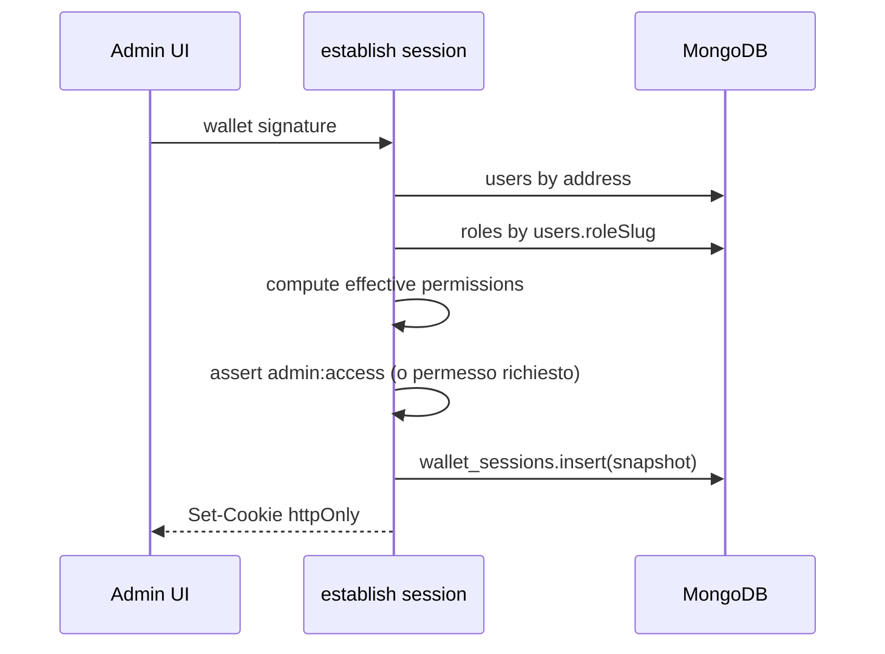
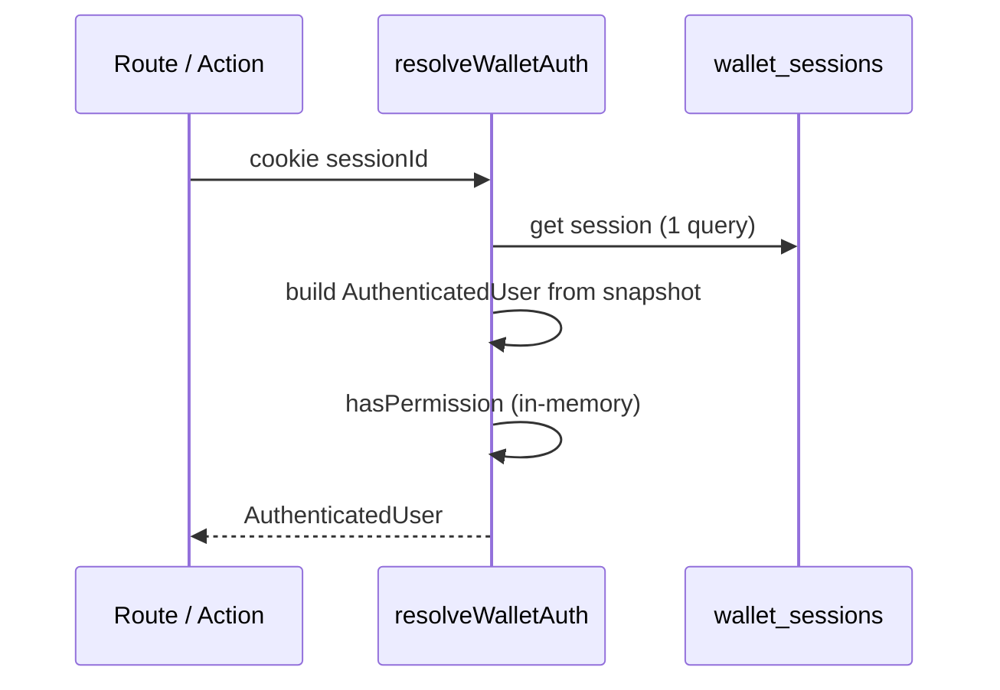
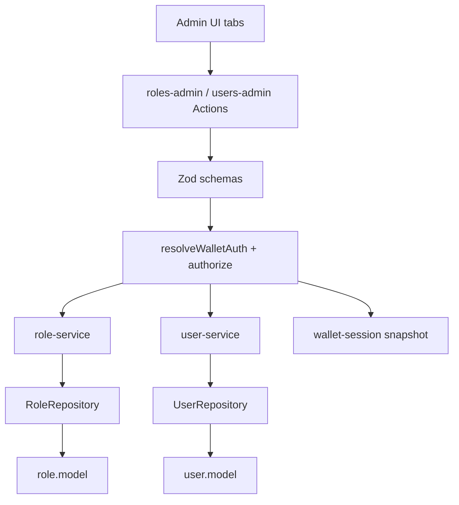

# Piano: ruoli come entità di database

Implementazione incrementale per spostare i ruoli da stringhe hardcoded nel codice
a **documenti persistenti** in MongoDB, collegati agli utenti e gestibili dalla
pagina **Manage users and roles**. Ogni punto corrisponde a **un commit** (o a una
PR piccola).

Riferimenti:
- [users-management.md](./users-management.md) — dominio utenti, permessi, API REST
- [users-administration.md](./users-administration.md) — pannello `/admin/users`
- [wallet-admin-session.md](./wallet-admin-session.md) — sessione wallet admin

## Obiettivo

1. **Collection `roles`** con slug, nome, descrizione e **array `permissions`**
   (stesso vocabolario di `USER_PERMISSIONS` attuale).
2. **Relazione utente → ruolo** via `roleSlug` (FK logica su `roles.slug`), al posto
   dell'enum `role` hardcoded nello schema utente.
3. **Controllo permessi** basato sui permessi del ruolo assegnato all'utente, non
   su `ROLE_PERMISSIONS` in codice.
4. **UI admin** per CRUD ruoli nella sezione *Manage users and roles* (tab o route
   dedicata accanto alla tabella utenti già esistente).
5. **Sessione con snapshot permessi** per evitare join DB a ogni verifica di
   autorizzazione nelle richieste autenticate.

**Fuori scope (v1):** permessi come collection separata con UI drag-and-drop;
deleghe temporanee; ruoli gerarchici (ereditarietà); ABAC; multi-ruolo per utente.

---

## Stato attuale vs target

| Aspetto | Oggi | Target |
| --- | --- | --- |
| Definizione ruoli | `USER_ROLES` in `types.ts` | Documenti in collection `roles` |
| Permessi per ruolo | `ROLE_PERMISSIONS` in `permissions.ts` | Campo `permissions[]` sul documento ruolo |
| Utente → ruolo | `users.role: enum` | `users.roleSlug: string` → `roles.slug` |
| `hasPermission(user, p)` | Fallback da mappa statica | `role.permissions` risolti dal DB (o snapshot) |
| Admin UI ruoli | Non esiste | Tabella CRUD in *Manage users and roles* |
| API ruoli | Non esiste | `GET/POST /api/roles`, `GET/PATCH/DELETE /api/roles/:slug` |
| Sessione wallet | Salva solo `address` | Snapshot `roleSlug`, `status`, `permissions[]` |
| `UserSnapshot` client | Solo `role`, `status` | + `roleSlug`, `permissions[]` per gating UI |

### Invarianti da preservare

- Ogni **mutazione** richiede firma wallet verificata **oppure** sessione wallet
  valida ([wallet-admin-session.md](./wallet-admin-session.md)).
- Validazione input con **Zod** prima del service layer.
- Il dominio non importa `mongoose`; accesso dati via **port/adapter**.
- Il client **non è fonte di verità** per permessi: lo snapshot serve solo alla UX;
  il server ri-valida sempre.

---

## Catalogo permessi (invariato in v1)

I permessi restano un **vocabolario tipizzato in codice** (`USER_PERMISSIONS` in
`types.ts`). Non diventano documenti DB in v1: sono capability note
dell'applicazione. I ruoli selezionano un sottoinsieme da questo catalogo.

| Permission | Descrizione | Ruoli seed v1 |
| --- | --- | --- |
| `pages:read` | Accesso in lettura alle pagine | reader, author, admin |
| `authors:write:own` | Modifica del proprio profilo autore | author, admin |
| `authors:write:any` | Modifica di qualsiasi profilo autore | admin |
| `authors:delete:any` | Eliminazione profili autore | admin |
| `users:read` | Lettura elenco/dettaglio utenti | admin |
| `users:write` | Creazione/aggiornamento utenti | admin |
| `users:delete` | Rimozione utenti | admin |
| `admin:access` | Accesso area `/admin` | admin |
| `roles:read` | Lettura elenco/dettaglio ruoli | admin |
| `roles:write` | Creazione/aggiornamento ruoli | admin |
| `roles:delete` | Rimozione ruoli custom | admin |

I tre permessi `roles:*` sono **nuovi** e vanno aggiunti al catalogo e al ruolo
seed `admin`.

---

## Modello dati

### Collection `roles`

```ts
/** MongoDB collection for platform roles. */
export const ROLE_COLLECTION_NAME = "roles";

type RoleDocument = {
  slug: string;           // chiave naturale, es. "admin" — unique, indexed
  name: string;           // etichetta UI, es. "Administrator"
  description?: string;   // testo opzionale per admin UI
  permissions: string[]; // sottoinsieme di USER_PERMISSIONS
  isSystem: boolean;      // true = ruolo seed, non eliminabile
  createdAt: Date;
  updatedAt: Date;
};
```

**Indici:**
- `{ slug: 1 }` unique
- `{ isSystem: 1 }` (query seed / protezione delete)

**Regole di dominio:**

| Regola | Motivo |
| --- | --- |
| `slug` lowercase, `[a-z0-9-]+`, 2–32 char | Coerenza con path API `/api/roles/:slug` |
| `permissions` ⊆ `USER_PERMISSIONS` | Evita permessi fantasma |
| Ruolo `admin` seed: deve sempre includere `admin:access`, `users:write`, `roles:write` | Anti lock-out amministrativo |
| `isSystem: true` → `DELETE` vietato | Protegge reader/author/admin |
| `isSystem: true` → `slug` immutabile | Migrazione e FK utenti stabili |
| Ruolo con utenti assegnati → `DELETE` vietato | Integrità referenziale applicativa |

### Collection `users` (modifica)

```diff
  {
    address: string,
-   role: "admin" | "author" | "reader",
+   roleSlug: string,          // FK → roles.slug, indexed
    status: "active" | "suspended" | "pending",
-   permissions: string[],    // override opzionale (vedi sotto)
+   permissionOverrides: string[], // grant extra puntuali (opzionale v1)
    preferences: { ... },
    metadata: { ... },
  }
```

**Relazioni:**

```
roles (1) ──slug──◄ (N) users.roleSlug
users (1) ──address──► (0..1) authors
```

| Collection | Responsabilità |
| --- | --- |
| `roles` | Definizione ruoli e permessi associati |
| `users` | Identità wallet + **riferimento** al ruolo + override opzionali |
| `authors` | Profilo pubblico — invariato |
| `wallet_sessions` | Sessione autenticata + **snapshot permessi** (vedi sotto) |

### Permessi effettivi

```ts
// lib/users/permissions.ts — target
function getEffectivePermissions(user: User, role: Role): UserPermission[] {
  const base = new Set(role.permissions);
  for (const grant of user.permissionOverrides ?? []) {
    base.add(grant);
  }
  return [...base];
}

function hasPermission(
  user: User,
  role: Role,
  permission: UserPermission,
): boolean {
  return getEffectivePermissions(user, role).includes(permission);
}
```

**Deprecazione:** rimuovere `ROLE_PERMISSIONS` e `USER_ROLES` come fonte runtime.
Restano solo come **seed iniziale** nello script di migrazione.

**Override utente (`permissionOverrides`):** opzionale in v1. Se non serve subito,
rimandare il campo e usare solo `role.permissions`. Il piano prevede il campo per
compatibilità con l'attuale `users.permissions` (rinominato per chiarezza).

### Tipo dominio `Role`

```ts
export type Role = {
  slug: string;
  name: string;
  description: string | null;
  permissions: UserPermission[];
  isSystem: boolean;
  createdAt: string;
  updatedAt: string;
};

export type User = {
  address: string;
  roleSlug: string;              // sostituisce role: UserRole
  status: UserStatus;
  permissionOverrides: UserPermission[];
  preferences: UserPreferences;
  metadata: Record<string, unknown>;
  createdAt: string;
  updatedAt: string;
};

/** Utente con permessi già risolti — usato in auth e snapshot */
export type AuthenticatedUser = User & {
  permissions: UserPermission[];
  role: Role;                    // ruolo espanso, opzionale se si preferisce solo permissions
};
```

---

## Sessione utente e caching permessi

### Problema

Oggi, con sessione wallet attiva, ogni richiesta protetta esegue:

1. Lettura `wallet_sessions` → `address`
2. Lettura `users` → `role` / `permissions`
3. (Target) Lettura `roles` → `permissions`

I check `hasPermission` in sé sono in-memory, ma **caricare l'utente dal DB a
ogni request** non scala e non è necessario se i permessi cambiano raramente
rispetto alla frequenza delle richieste.

### Requisito

> Dopo l'autenticazione, i controlli permesso su API/Actions devono usare dati
> già in memoria sulla request, **senza ulteriori query** su `users` o `roles`.

### Opzioni valutate

| Approccio | Pro | Contro | Verdetto |
| --- | --- | --- | --- |
| **A. Query DB ogni request** | Sempre aggiornato | 2–3 query/request; latenza | ❌ Non accettabile come steady state |
| **B. Snapshot in `wallet_sessions`** | 1 query/request (solo sessione); riusa infrastruttura esistente; revoca centralizzata | Permessi stale fino a invalidazione/TTL | ✅ **Raccomandato v1** |
| **C. Cache in-memory / Redis per address** | Decoupled dalla sessione | Altro componente; invalidazione distribuita su Vercel | ⏳ v2 se serve cache condivisa cross-istanza |
| **D. JWT con `permissions` nel payload** | Stateless; nessun DB per validazione token | Revoca immediata difficile; refresh su cambio ruolo; non si integra naturalmente con firma wallet; JWT in cookie HttpOnly ≈ sessione opaca | ❌ Non raccomandato |
| **E. JWT firmato server + session store per revoca** | Ibrido | Complessità doppia senza benefici netti rispetto a B | ❌ Over-engineering |

### Raccomandazione: snapshot server-side nella sessione wallet (B)

Estendere il documento `wallet_sessions`:

```diff
  {
    sessionId: string,
    address: string,
+   roleSlug: string,
+   status: UserStatus,
+   permissions: string[],     // effective permissions al momento del establish
    expiresAt: Date,
    lastSeenAt: Date,
  }
```

**Flusso `establish` (POST `/api/auth/session`):**



**Flusso request autenticata:**



**Nessuna query su `users` / `roles`** finché la sessione è valida.

### Invalidazione snapshot (obbligatoria)

| Evento | Azione |
| --- | --- |
| `PATCH /api/users/:address` cambia `roleSlug` | `deleteByAddress(target)` su tutte le sessioni dell'utente |
| `PATCH /api/roles/:slug` cambia `permissions` | `deleteByRoleSlug(slug)` su tutte le sessioni con quel `roleSlug` |
| `users.status` → `suspended` | Revoca sessioni utente |
| `DELETE /api/auth/session` (logout) | Revoca sessione corrente |
| TTL scaduto | Già gestito da `expiresAt` + TTL index |

Implementare `WalletSessionStore.deleteByRoleSlug(slug)` nel port.

### Richieste con firma wallet (senza sessione)

Per API chiamate con header `x-wallet-*` (autori, fallback admin):

- **1 round-trip DB** accettabile: `users` + `roles` join logico nel service
- Nessuno snapshot: permessi sempre freschi

### Snapshot lato client (`UserSnapshot`)

Per navigazione, `RouteGuard`, voci menu — **non** usare la sessione HttpOnly
(il client non la legge). Estendere `getUserSnapshotAction`:

```ts
export type UserSnapshot = {
  normalizedAddress: string;
  isConnected: boolean;
  roleSlug: string;
  roleName: string;           // display
  status: UserStatus;
  permissions: UserPermission[];  // risolti server-side
  hasAuthorProfile: boolean;
  declinedAuthorPage: boolean;
};
```

Caricato **una volta** al connect / refresh event (`user-snapshot-sync.ts`).
I componenti chiamano `hasPermission(snapshot, perm)` in memoria — zero DB lato
client.

**Sincronizzazione:** dopo mutazioni admin su utente/ruolo, dispatch
`requestUserSnapshotRefresh()` + revoca sessioni server-side se l'utente
interessato è quello connesso.

### Perché non JWT

1. L'auth primaria è **wallet signature**, non username/password: il JWT non
   elimina il passo di establish.
2. Un JWT con permessi in cookie HttpOnly è funzionalmente equivalente a una
   sessione opaca con payload server-side, ma aggiunge rotazione chiavi, clock
   skew e revoca complessa.
3. Cambio permessi su un ruolo richiede comunque invalidazione: con JWT servirebbe
   blacklist o TTL molto corto → di nuovo query o re-establish frequente.
4. La sessione Mongo esistente è già **server-side, revocabile, auditabile**.

**Conclusione:** sessione server-side con snapshot permessi; JWT fuori scope.

---

## Architettura a strati

```
apps/web/src/
  lib/
    roles/
      types.ts
      errors.ts
      schemas.ts
      permissions.ts          # USER_PERMISSIONS catalog, hasPermission(...)
      repository.ts           # RoleRepository port
      role-service.ts
      adapters/
        mongo-role-repository.ts
      testing/
        in-memory-role-repository.ts
    users/
      permissions.ts          # delega a roles/permissions + effective resolution
      user-service.ts           # join role su getByAddress; setRoleSlug
      ...
    auth/
      resolve-wallet-auth.ts    # ritorna AuthenticatedUser da session snapshot o DB
      wallet-session-store.ts   # + deleteByRoleSlug
    db/models/
      role.model.ts
      user.model.ts             # roleSlug al posto di role enum
      wallet-session.model.ts   # + snapshot fields
    navigation/
      route-guard.ts            # API_ROUTES + roles:*
  app/
    api/
      roles/
        route.ts                # GET, POST
        [slug]/
          route.ts              # GET, PATCH, DELETE
    actions/
      roles-admin.ts            # CRUD ruoli (session-first come users-admin)
    admin/
      users/
        page.tsx                # tab Utenti (esistente)
      roles/
        page.tsx                # tab Ruoli (nuova)
      layout.tsx                # shell "Manage users and roles" con tab
```

### Flusso dipendenze



---

## API REST — `/api/roles`

Stesso pattern di `/api/users`: rate limit, Zod, `resolveWalletAuth`, assert
permessi, service layer.

| Metodo | Path | Permesso | Body / note |
| --- | --- | --- | --- |
| `GET` | `/api/roles` | `roles:read` | Lista ruoli ordinata per `name` |
| `POST` | `/api/roles` | `roles:write` | `{ slug, name, description?, permissions[] }` |
| `GET` | `/api/roles/:slug` | `roles:read` | Dettaglio singolo ruolo |
| `PATCH` | `/api/roles/:slug` | `roles:write` | `{ name?, description?, permissions[]? }`; `slug` immutabile se `isSystem` |
| `DELETE` | `/api/roles/:slug` | `roles:delete` | Vietato se `isSystem` o `userCount > 0` |

**Response tipo:**

```json
{
  "slug": "moderator",
  "name": "Moderator",
  "description": "Can curate authors",
  "permissions": ["pages:read", "authors:write:any"],
  "isSystem": false,
  "userCount": 3,
  "createdAt": "2026-06-09T12:00:00.000Z",
  "updatedAt": "2026-06-09T12:00:00.000Z"
}
```

`userCount` calcolato dal service (aggregate o count su `users.roleSlug`).

### Estensione `route-guard.ts`

```ts
{
  id: "roles-list",
  methods: ["GET"],
  pathPattern: "/api/roles",
  permission: "roles:read",
},
{
  id: "roles-create",
  methods: ["POST"],
  pathPattern: "/api/roles",
  permission: "roles:write",
},
// ... GET/PATCH/DELETE /api/roles/:slug
```

### Modifica API utenti

- `POST /api/users` e `PATCH /api/users/:address` accettano `roleSlug` al posto
  di `role` enum.
- Validazione Zod: `roleSlug` deve esistere in `roles` (check service).
- `role-transitions.ts`: adattare per regole basate su slug (es. passaggio a
  `author` richiede profilo autore — invariante invariata).

---

## Server Actions admin ruoli

File: `app/actions/roles-admin.ts` — stesso pattern session-first di
`users-admin.ts`:

| Action | Comportamento |
| --- | --- |
| `listRolesAction()` | Sessione o firma; ritorna `Role[]` con `userCount` |
| `createRoleAction(input)` | Crea ruolo custom |
| `updateRoleAction(input)` | Aggiorna nome/descrizione/permessi; invalida sessioni |
| `deleteRoleAction({ slug })` | Elimina se consentito |

---

## UI — Manage users and roles

### Layout a tab

La voce menu **Manage users and roles** (`/admin/users` o `/admin/manage`) apre
un layout condiviso:

| Tab | Route | Contenuto |
| --- | --- | --- |
| **Users** | `/admin/users` | Tabella esistente *Users administration* — invariata nel titolo |
| **Roles** | `/admin/roles` | Nuova tabella gestione ruoli |

`apps/web/src/app/admin/layout.tsx` (o sotto-layout) mostra tab bar e richiede
`admin:access` via `RouteGuard`.

### Tabella ruoli (v1)

| Colonna | Comportamento |
| --- | --- |
| `slug` | Read-only dopo creazione |
| `name` | Editabile inline |
| `description` | Editabile inline (opzionale) |
| `permissions` | Multi-select da `USER_PERMISSIONS` (checkbox group) |
| `userCount` | Read-only |
| `isSystem` | Badge; nasconde delete se true |
| Azioni | Save riga, Delete (se consentito), + Add role |

**Create role:** dialog o riga espandibile con slug, name, permissions.

**Salvataggio:** una sessione wallet attiva — nessuna firma ripetuta (come utenti).

### Aggiornamento tabella utenti

- Colonna `role`: select popolata da `listRolesAction()` (slug + name), non più
  da `USER_ROLES` statico.
- Salvataggio utente invia `roleSlug`.

---

## Migrazione dati

### Script `scripts/seed-roles.ts` (o comando pnpm)

1. Inserisce 3 ruoli seed se collection vuota:

| slug | name | isSystem | permissions |
| --- | --- | --- | --- |
| `reader` | Reader | true | `pages:read` |
| `author` | Author | true | `pages:read`, `authors:write:own` |
| `admin` | Admin | true | tutti i permessi catalogo v1 incluso `roles:*` |

2. Per ogni documento `users` con campo legacy `role`:
   - `roleSlug = role` (stesso valore stringa)
   - rimuove campo `role` (o migrazione Mongoose con alias temporaneo)

3. Migra `users.permissions` → `permissionOverrides` se presenti.

**Ordine deploy:** seed ruoli → migrazione utenti → deploy codice nuovo.

### Compatibilità transitoria (opzionale)

Durante la migrazione, il mapper Mongo può leggere `role` se `roleSlug` assente
e loggare warning. Rimuovere dopo conferma migrazione.

---

## Sicurezza

| Rischio | Mitigazione |
| --- | --- |
| Admin si rimuove `admin:access` dal proprio ruolo | Validazione service: ruolo `admin` seed non può perdere permessi minimi |
| Sessione con permessi stale | Invalidazione su cambio ruolo/permessi; TTL 30 min |
| Client manipola snapshot UI | Server ri-valida sempre; snapshot client solo per UX |
| Creazione ruolo con permessi arbitrari | Zod + whitelist `USER_PERMISSIONS` |
| Enum injection in `roleSlug` | Validazione slug regex + esistenza documento |
| Rate limiting | Stessi limiti di `/api/users` |

---

## Step incrementali (commit)

### Step 1 — Dominio ruoli e seed

- `lib/roles/*` (types, errors, schemas, repository port, role-service)
- `lib/db/models/role.model.ts`
- `mongo-role-repository` + fake in-memory
- `USER_PERMISSIONS` esteso con `roles:*`
- Script seed ruoli system
- Unit test service + permessi effettivi

### Step 2 — Migrazione utenti a `roleSlug`

- Aggiorna `user.model.ts`, mapper, types, schemas Zod
- `user-service`: join role su `getByAddress`; ritorna `AuthenticatedUser`
- Adatta `permissions.ts` (rimuovi `ROLE_PERMISSIONS` runtime)
- Script migrazione `users.role` → `users.roleSlug`
- Aggiorna tutti i test utenti / authorize / route-guard

### Step 3 — Snapshot permessi in sessione wallet

- Estendi `wallet-session.model` + store + `establish` / `resolve`
- `resolve-wallet-auth` ritorna `AuthenticatedUser` da snapshot
- `deleteByAddress`, `deleteByRoleSlug` su session store
- Invalidazione in `user-service` e `role-service` su update
- Test integrazione session + permessi

### Step 4 — API REST `/api/roles`

- Route handlers + `user-mutations` pattern
- Registrazione in `API_ROUTES`
- Test `roles-api.test.ts` con MongoMemoryServer

### Step 5 — Server Actions `roles-admin`

- Actions session-first
- Test con mock cookies/session

### Step 6 — UI tab Roles + aggiornamento select utenti

- Layout tab *Manage users and roles*
- `RolesAdminTableView` + page `/admin/roles`
- Popola select ruolo in `UsersAdminTableView`
- Test componenti

### Step 7 — UserSnapshot con permessi

- Estendi `getSnapshot` + `UserSnapshot` type
- `SiteHeaderNav` / `RouteGuard`: `hasPermission` da snapshot
- Rimuovi dipendenze residue da `USER_ROLES` / `getUserRole` legacy dove possibile
- Test snapshot e navigazione

### Step 8 — Coverage e documentazione

- Aggiorna `vitest.config.ts` include `lib/roles/**`
- `pnpm web:test:coverage` ≥ 80%
- Aggiorna [users-management.md](./users-management.md) con riferimento a ruoli DB

---

## Test plan

| Area | Casi |
| --- | --- |
| `role-service` | CRUD; blocco delete system; blocco delete con utenti; validazione permessi ⊆ catalogo; anti lock-out admin |
| `permissions` | effective = role + overrides; `hasPermission` |
| `resolve-wallet-auth` | sessione con snapshot; revoca su cambio ruolo |
| `roles API` | 401/403 senza auth; CRUD happy path; 409 delete con utenti |
| `users API` | `roleSlug` valido/invalido |
| `roles-admin actions` | session-first vs firma |
| UI | tab roles render; select ruoli utenti da DB |
| Migrazione | script idempotente su DB vuoto e popolato |

---

## Checklist pre-merge

- [ ] Nessun `ROLE_PERMISSIONS` / `USER_ROLES` usato per autorizzazione runtime
- [ ] `hasPermission` legge permessi dal ruolo DB o snapshot sessione
- [ ] Mutazione ruolo/utente invalida sessioni affette
- [ ] Ruoli system non eliminabili; admin non può auto-lock-out
- [ ] API e Actions coperte da test; coverage ≥ 80%
- [ ] Script migrazione eseguito su staging
- [ ] Tab Utenti e Ruoli accessibili da *Manage users and roles*

---

## Decisioni riepilogative

| Domanda | Decisione |
| --- | --- |
| Permessi in DB? | No in v1 — catalogo in codice; ruoli referenziano subset |
| FK utente → ruolo | `users.roleSlug` → `roles.slug` |
| Evitare DB per permesso? | Snapshot in `wallet_sessions` + `UserSnapshot` lato client |
| JWT? | Non usato; sessione opaca server-side sufficiente e già presente |
| Override per utente? | `permissionOverrides[]` opzionale (ex `users.permissions`) |
| UI | Tab Roles accanto a tab Users sotto *Manage users and roles* |
