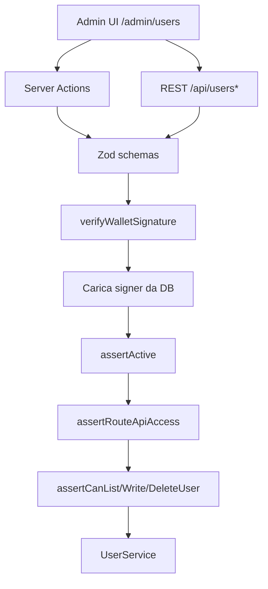

# Piano: pannello amministrazione utenti

Implementazione incrementale della pagina admin per la gestione CRUD degli utenti
della piattaforma Andromeda (`apps/web`). Ogni punto corrisponde a **un commit**
(o a una PR piccola).

Riferimenti:
- [users-management.md](./users-management.md) — dominio utenti, API REST, permessi (già implementati)
- [author-page.md](./author-page.md) — pattern UI editor autore (firma wallet + server actions)

## Obiettivo

1. **Pagina `/admin/users`** accessibile solo agli admin, con tabella degli utenti
   e operazioni CRUD complete.
2. **Voce di menu** nella dropdown del wallet (barra superiore) per raggiungere
   il pannello — visibile **solo** se `users.role === "admin"`.
3. **Sicurezza end-to-end**: ogni consumo delle API `/api/users*` richiede firma
   wallet verificata e permessi admin (`users:read|write|delete`).
4. **Schema estendibile**: la UI e i contratti devono tollerare nuovi campi utente
   senza refactoring massiccio (campi typed + `metadata`).

**Prerequisito:** il backend utenti (collection `users`, service, API, autorizzazioni)
è già operativo — vedi [users-management.md](./users-management.md). Questo piano
copre **solo il layer delivery/UI** e gli eventuali adattamenti minimi al dominio.

---

## Stato attuale vs target

| Aspetto | Oggi | Target |
| --- | --- | --- |
| API `/api/users` | CRUD completo con firma + permessi | Invariato; verificato e documentato |
| Server Actions utenti | Solo snapshot/connect (`actions/users.ts`) | + `listUsersAction`, `createUserAction`, `updateUserAction`, `deleteUserAction` |
| Pagina admin | Dashboard placeholder (`/admin`) | + `/admin/users` con tabella editabile |
| Menu dropdown wallet | Profile settings, language, become author, logout | + **Manage users** (solo admin) |
| Navigazione header | Link "Admin" → `/admin` | Invariato; dropdown porta a `/admin/users` |
| Componente tabella | Non esiste | Tabella custom leggera (no libreria esterna) |

---

## Requisiti funzionali

### Pagina `/admin/users`

| Operazione | Comportamento UI |
| --- | --- |
| **Read (lista)** | Tabella con colonne: address (troncato + link explorer opzionale), role, status, createdAt. Ordinamento per `createdAt` desc (default). |
| **Create** | Form/riga "aggiungi utente": address, role, status. Firma wallet admin prima del submit. |
| **Update** | Celle editabili inline per `role` e `status` (select). Salvataggio riga con conferma + firma. |
| **Delete** | Pulsante elimina per riga con dialog di conferma + firma. |

**Campi v1 in tabella:** `address`, `role`, `status`, `createdAt`.

**Campi v2 (fuori scope iniziale, ma progettati):** `permissions` (multi-select avanzato),
`preferences`, campi in `metadata`. La tabella espone colonne da una **config dichiarativa**
(`USER_ADMIN_COLUMNS`) così aggiungere un campo typed richiede solo config + mapper,
non riscrivere il componente.

### Accesso dalla dropdown

La dropdown del ruolo (`RoleMenuDropdown`) mostra oggi voci comuni a tutti i ruoli.
Per gli admin si aggiunge:

| Voce menu | Visibilità | Destinazione |
| --- | --- | --- |
| Manage users | `role === "admin"` | `/admin/users` |

La voce va **sopra** il separatore prima di Logout, dopo le voci profilo/lingua.
Non sostituisce il link "Admin" nell'header (che resta entry point alla dashboard).

### Protezione pagina

- Layout `/admin` già wrappa `RouteGuard routeId="admin"` → richiede `admin:access`.
- `/admin/users` eredita lo stesso layout; nessun middleware Next.js aggiuntivo.
- Utente non admin: messaggio accesso negato (stesso pattern di `/admin`).

---

## Estensibilità schema utente

Il dominio espone già un modello a strati:

```ts
// lib/users/types.ts — campi typed
type User = {
  address: string;
  role: UserRole;
  status: UserStatus;
  permissions: UserPermission[];
  preferences: UserPreferences;
  metadata: Record<string, unknown>;  // campi sperimentali
  createdAt: string;
  updatedAt: string;
};
```

**Regole per evolvere senza breaking change:**

| Tipo di estensione | Dove aggiungere | Impatto UI admin |
| --- | --- | --- |
| Nuovo campo stabile (es. `displayName`) | `types.ts` + Mongoose schema + Zod + mapper | Nuova entry in `USER_ADMIN_COLUMNS` |
| Nuova preferenza | `UserPreferences` + Zod opzionale | Colonna opzionale o pannello dettaglio riga |
| Campo sperimentale | `metadata.myField` | Colonna `metadata` con renderer generico o nascosta in v1 |
| Nuovo permesso | `USER_PERMISSIONS` + `ROLE_PERMISSIONS` | Colonna permissions (v2) |
| Nuovo ruolo | `USER_ROLES` + migrazione DB | Aggiornare select role nella tabella |

**Pattern consigliato — column registry:**

```ts
// lib/users/admin-user-columns.ts
export type AdminUserColumnId = "address" | "role" | "status" | "createdAt";

export type AdminUserColumnDef = {
  id: AdminUserColumnId;
  label: string;
  editable: boolean;
  render: (user: User) => React.ReactNode;
  getEditValue?: (user: User) => unknown;
};
```

Quando lo schema cresce, si estende `AdminUserColumnId` e si aggiunge una definizione;
la logica CRUD resta su `UserService` e gli schemi Zod.

---

## Sicurezza

### Modello a difesa in profondità



### Controlli già presenti (da preservare)

| Layer | File | Controllo |
| --- | --- | --- |
| Firma wallet | `lib/auth/verify-wallet.ts` | Nonce, expiry, replay, `verifyMessage` |
| Permessi API | `lib/navigation/route-guard.ts` | `API_ROUTES` mappa metodo+path → permission |
| Autorizzazione dominio | `lib/users/authorize.ts` | `assertCanListUsers`, `assertCanWriteUser`, `assertCanDeleteUser` |
| Utente sospeso | `lib/users/user-service.ts` | `assertActive` blocca mutazioni |
| Validazione input | `lib/users/schemas.ts` | Zod; `permissions` ⊆ enum noto |
| Rate limit API | `lib/users/api-utils.ts` | IP-scoped, bucket per operazione |
| Rate limit actions | `lib/auth/action-rate-limit.ts` | Stesso pattern per server actions |
| Errori client | `lib/users/api-errors.ts` | Nessun leak Mongo/stack |

### Requisiti aggiuntivi per questo feature

| ID | Rischio | Mitigazione |
| --- | --- | --- |
| **UA-01** | UI bypassa auth chiamando API senza firma | Server Actions come canale primario; ogni action riusa `run*UserMutation` |
| **UA-02** | Admin elimina se stesso per errore | Conferma esplicita; opzionale: bloccare delete se `target === signer` (v2) |
| **UA-03** | Escalation ruolo via payload manipolato | Zod + `assertCanWriteUser`; solo admin con `users:write` in DB |
| **UA-04** | Enumeration utenti da client non admin | `GET /api/users` già protetto; nessun prefetch pubblico della lista |
| **UA-05** | CSRF su server actions | Next.js Server Actions + firma wallet (non cookie session) |
| **UA-06** | Transizione role incoerente (author senza profilo) | `UserService.setRole` valida transizioni; documentare regole in service |

### Verifica admin sulle API

Ogni richiesta a `/api/users` segue questo flusso (già in `user-mutations.ts`):

1. `parseWalletAuthHeaders` o body con `walletAuthSchema`
2. `verifyWalletSignature` → indirizzo firmatario
3. Caricamento documento `users` del firmatario
4. `assertActive(signer)`
5. `assertRouteApiAccess(signer, method, pathname)` → es. `GET /api/users` richiede `users:read`
6. `assertCanListUsers(signer)` (o write/delete specifico)

**Condizione admin operativa:** `signer.role === "admin"` (permessi derivati da
`ROLE_PERMISSIONS`). L'env `ADMIN_ADDRESSES` non deve essere usato per autorizzare
le API utenti — solo DB.

---

## Architettura delivery

```
apps/web/src/
  app/
    admin/
      users/
        page.tsx                    # pagina server; passa contesto minimo
    actions/
      users-admin.ts                # list/create/update/delete actions
  lib/
    users/
      admin-user-columns.ts         # registry colonne tabella (estensibile)
      admin-users-state.ts          # stato puro: draft righe, validazione, dirty
      admin-users-mappers.ts        # User ↔ row view model
  components/
    admin/
      UsersAdminPage.tsx            # container: fetch, mutations, loading
      UsersAdminTableView.tsx       # presentational: tabella + form create
      UsersAdminRowActions.tsx      # save/delete per riga
  lib/navigation/
    role-menu.ts                    # + MANAGE_USERS_MENU_ITEM (admin only)
  components/
    RoleMenuDropdown.tsx            # link a /admin/users per admin
```

### Flusso mutazione (preferito — server actions)

Allineato al pattern autore (`app/actions/authors.ts`):

```
UI → createSignedWalletPayload (wagmi)
   → listUsersAction / createUserAction / updateUserAction / deleteUserAction
   → Zod parse
   → enforceActionRateLimit
   → run*UserMutation (user-mutations.ts)
   → UserService
```

**Perché server actions e non fetch diretto al client:**
- Coerenza con il resto dell'app (authors)
- Un solo punto di validazione/auth riusato
- Meno superficie per errori di header auth nel client

Le REST API restano disponibili per integrazioni future/script; la UI admin usa actions.

---

## UI — design della tabella

### Layout

```
┌─────────────────────────────────────────────────────────────┐
│  Users administration                                       │
│  Manage platform accounts, roles and status.                │
├─────────────────────────────────────────────────────────────┤
│  [+ Add user]                                               │
├──────────┬────────┬──────────┬────────────┬────────────────┤
│ Address  │ Role ▾ │ Status ▾ │ Created    │ Actions        │
├──────────┼────────┼──────────┼────────────┼────────────────┤
│ 0xabc…   │ admin  │ active   │ 2026-01-15 │ [Save] [Delete]│
│ 0xdef…   │ reader │ active   │ 2026-02-01 │ [Save] [Delete]│
└──────────┴────────┴──────────┴────────────┴────────────────┘
```

### Pattern componenti (come author editor)

| Layer | Responsabilità | Esempio esistente |
| --- | --- | --- |
| **State puro** | Draft, validazione, detect dirty | `author-profile-editor-state.ts` |
| **View** | Solo rendering, nessun fetch | `AuthorProfileEditorView.tsx` |
| **Container** | Hook wagmi, `runWithLoading`, actions | `AuthorProfileEditor.tsx` |

### Stati UX

| Stato | Comportamento |
| --- | --- |
| Loading | Spinner centrato durante list/save/delete |
| Empty | Messaggio "No users yet" + CTA Add user |
| Error | Banner con messaggio generico; dettagli solo in console server |
| Success | Toast/notifica (`notifications`) dopo save/delete |
| Unsaved row | Evidenziazione riga dirty; Save abilitato solo se valida |

### Create user

Modale o riga espandibile sopra la tabella:

- `targetAddress` — input con validazione checksum
- `role` — select (`reader` default)
- `status` — select (`active` default)
- Submit → firma wallet → `createUserAction`

---

## Step di implementazione

Ogni step è un commit (o PR piccola) con test associati. Ordine consigliato:

| # | Step | File principali | Test |
| --- | --- | --- | --- |
| 1 | Registry colonne + mapper view model | `admin-user-columns.ts`, `admin-users-mappers.ts` | unit su mapper e column config |
| 2 | Stato puro tabella (draft, dirty, validate) | `admin-users-state.ts` | `admin-users-state.test.ts` |
| 3 | Server Actions CRUD admin | `app/actions/users-admin.ts` | `users-admin.test.ts` (mock mutations) |
| 4 | Voce menu dropdown admin | `role-menu.ts`, `RoleMenuDropdown.tsx` | `role-menu.test.ts` aggiornato |
| 5 | View tabella (presentational) | `UsersAdminTableView.tsx` | RTL smoke test base |
| 6 | Container pagina + wiring | `UsersAdminPage.tsx`, `admin/users/page.tsx` | integrazione con mock actions |
| 7 | Link da dashboard admin | `admin/page.tsx` — card "Users" → `/admin/users` | — |
| 8 | Regole transizione ruolo in service (se mancanti) | `user-service.ts` | estendere `user-service.test.ts` |
| 9 | Coverage ≥ 80% su nuovi moduli `lib/users/admin-*` | `vitest.config.ts` include | `pnpm web:test:coverage` |

### Dettaglio step 3 — Server Actions

```ts
// app/actions/users-admin.ts
"use server";

export async function listUsersAction(input: unknown): Promise<User[]>
export async function createUserAction(input: unknown): Promise<User>
export async function updateUserAction(input: unknown): Promise<User>
export async function deleteUserAction(input: unknown): Promise<void>
```

Schemi action (wrapper su schemi esistenti + `targetAddress` dove serve):

```ts
// lib/users/schemas.ts — aggiunte
export const listUsersActionSchema = walletAuthSchema;
export const updateUserActionSchema = walletAuthSchema.extend({
  targetAddress: ethereumAddressSchema,
  ...updateUserBodySchema.shape,
});
export const deleteUserActionSchema = walletAuthSchema.extend({
  targetAddress: ethereumAddressSchema,
});
```

Ogni action delega a `runListUsersMutation` / `runCreateUserMutation` / ecc.
adattando il formato (headers virtuali o body unificato).

### Dettaglio step 4 — Menu dropdown

```ts
// lib/navigation/role-menu.ts
export const MANAGE_USERS_MENU_ITEM: RoleMenuItem = {
  id: "manage-users",
  label: "Manage users",
};

export function getRoleMenuItems(role: UserRole): RoleMenuItem[] {
  const items = [PROFILE_SETTINGS_MENU_ITEM, CHANGE_LANGUAGE_MENU_ITEM];
  if (role === "admin") {
    items.push(MANAGE_USERS_MENU_ITEM);
  }
  // ...
}
```

In `RoleMenuDropdown`: se `item.id === "manage-users"`, render `<Link href="/admin/users">`
invece di `<button>`.

---

## Criteri di accettazione

- [ ] Admin connesso vede **Manage users** nella dropdown; reader/author no.
- [ ] `/admin/users` mostra tabella utenti caricata via server action firmata.
- [ ] Admin può creare, modificare (role/status) ed eliminare utenti con firma wallet.
- [ ] Utente non admin non accede alla pagina (RouteGuard) né alle API (403).
- [ ] Utente `suspended` non può eseguire mutazioni (né come target di operazioni admin su di sé come signer).
- [ ] Nessun leak di errori DB/stack al client.
- [ ] Aggiunta futura colonna documentata via `USER_ADMIN_COLUMNS` senza toccare CRUD core.
- [ ] `pnpm web:test:coverage` ≥ 80% sulle aree incluse.

---

## Test plan manuale (post-deploy)

1. Seed admin in locale:
   ```javascript
   db.users.updateOne(
     { address: "0x…" },
     { $set: { role: "admin", status: "active" } },
     { upsert: true },
   )
   ```
2. Connetti wallet admin → dropdown mostra "Manage users".
3. Apri `/admin/users` → lista popolata.
4. Crea utente reader → compare in tabella.
5. Cambia role a `author` → save con firma → persistito in DB.
6. Elimina utente test → rimosso da tabella e DB.
7. Connetti wallet reader → "Manage users" assente; `/admin/users` → access denied.
8. DevTools Network: nessuna risposta `/api/users` con dati senza precedente firma.

---

## Fuori scope (step successivi)

- Paginazione, ricerca e filtri avanzati sulla tabella
- Editing inline di `permissions` granulari
- Audit log delle operazioni admin
- Bulk actions (multi-delete, bulk role change)
- SIWE con sessione server (oggi ogni mutazione richiede firma)
- Inviti utente, workflow sospensione con motivazione

---

## Comandi utili

```bash
pnpm web:test:coverage    # dopo ogni step
pnpm dev                  # verifica UI in locale
```

Vedi [users-management.md](./users-management.md) per comandi `mongosh` e seed admin.
