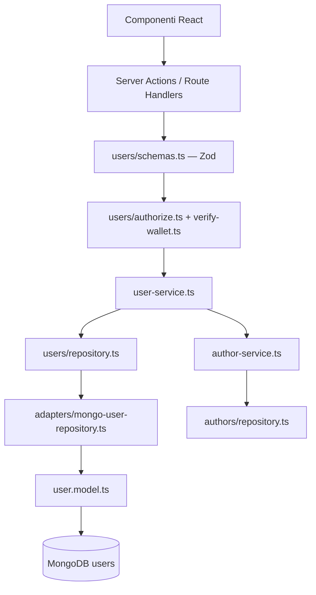

# Piano: gestione utenti e ruoli

Implementazione incrementale del modello utenti persistente per `apps/web`, con
centralizzazione di ruoli e autorizzazioni nella collection MongoDB `users`.
Ogni punto corrisponde a **un commit** (o a una PR piccola).

Riferimenti: [author-page.md](./author-page.md), [db-integration.md](./db-integration.md),
[roles.md](./roles.md) (ruoli persistiti in MongoDB e permessi da snapshot).

## Obiettivo

1. **Persistere gli utenti** in una collection `users` con schema estendibile.
2. **Modellare tre ruoli** — `admin`, `author`, `reader` — con regole di accesso
   e mutazione chiare e verificate server-side.
3. **Sostituire gradualmente** la derivazione del ruolo da env + presenza profilo
   autore con una fonte unica: il documento utente.
4. **Preparare estensioni future** — nuove proprietà utente e permessi granulari
   senza breaking change sul contratto di dominio.

**Fuori scope (step successivi):** pannello admin per gestione utenti via UI,
inviti, ban/sospensione con workflow, SIWE con sessione server persistente,
multi-wallet per lo stesso utente.

---

## Stato attuale vs target

| Aspetto | Oggi | Target |
| --- | --- | --- |
| Identità utente | Indirizzo wallet wagmi | Documento `users` keyed by `address` |
| Ruolo admin | `NEXT_PUBLIC_ADMIN_ADDRESSES` (env, esposto al client) | `users.role === "admin"` letto server-side; env solo per bootstrap/migrazione |
| Ruolo autore | Esiste documento in `authors` | `users.role === "author"` **e** profilo in `authors` |
| Ruolo lettore | Wallet connesso senza profilo / ha rifiutato onboarding | `users.role === "reader"` |
| Preferenze onboarding | Collection `walletpreferences` | Campo `users.preferences` (migrazione graduale) |
| Autorizzazione mutazioni | `lib/authors/authorize.ts` + `isAdminAddress` | `lib/users/authorize.ts` + `UserService` |
| UI ruolo | `getUserRole()` in `lib/auth/roles.ts` | `getUserRole()` alimentato da snapshot utente server |

### Invarianti da preservare

- Ogni mutazione richiede **firma wallet verificata** (`verify-wallet.ts`).
- Validazione input con **Zod** prima del service layer.
- Il dominio non importa `mongoose`; accesso dati via **port/adapter**.
- Nessun leak di `MONGODB_URI`, stack trace o errori driver al client.

---

## Ruoli e permessi

I ruoli di sistema (`reader`, `author`, `admin`) sono documenti nella collection
`roles`; gli utenti referenziano `users.roleSlug`. I permessi effettivi sono la
unione del subset del ruolo e di `users.permissionOverrides`. L’autorizzazione
runtime usa lo snapshot in `wallet_sessions` o `UserSnapshot` lato client — vedi
[roles.md](./roles.md).

### Matrice funzionale

| Ruolo | Accesso pagine (navigazione) | Lettura contenuti | Edit pagina autore propria | Edit pagina autore altrui | CRUD globale (admin, API, azioni) |
| --- | :---: | :---: | :---: | :---: | :---: |
| **reader** | ✓ tutte | ✓ | — | — | — |
| **author** | ✓ tutte | ✓ | ✓ | — | — |
| **admin** | ✓ tutte | ✓ | ✓ | ✓ | ✓ |

**Nota navigazione:** tutti i ruoli possono **visitare** le route pubbliche dell'app
(library, pagine autore, area `/admin` come pagina). Le **mutazioni** e i controlli
di editing sono gated dal ruolo e dai permessi — un lettore vede le pagine autore in
sola lettura; un non-admin che apre `/admin` vede messaggio di accesso negato (come
oggi con `AdminGate`), senza possibilità di CRUD.

### Come si ottiene ogni ruolo

| Ruolo | Condizione |
| --- | --- |
| **reader** | Default al primo collegamento wallet: creazione automatica documento `users` con `role: "reader"` |
| **author** | Utente crea il profilo autore (onboarding) → `role` aggiornato a `"author"` e documento in `authors` |
| **admin** | Assegnazione esplicita su `users` (seed da env, script migrazione, o mutazione admin-only) |

Un admin **non** perde le capacità di lettore/autore: il ruolo `admin` implica tutti
i permessi degli altri ruoli più quelli amministrativi.

### Permessi granulari (estensibilità)

Oltre al ruolo coarse, ogni utente porta un array `permissions` per abilitare
capacità future senza introdurre subito nuovi valori di `role`.

Permessi iniziali (v1):

| Permission | Descrizione | Ruoli default |
| --- | --- | --- |
| `pages:read` | Accesso in lettura a tutte le pagine | reader, author, admin |
| `authors:write:own` | Modifica del proprio profilo autore | author, admin |
| `authors:write:any` | Modifica di qualsiasi profilo autore | admin |
| `authors:delete:any` | Eliminazione profili autore | admin |
| `users:read` | Lettura elenco/dettaglio utenti | admin |
| `users:write` | Creazione/aggiornamento ruoli utenti | admin |
| `users:delete` | Rimozione utenti | admin |
| `admin:access` | Accesso operativo all'area `/admin` e alle API admin | admin |

```ts
// lib/users/permissions.ts — mapping ruolo → permessi default
const ROLE_PERMISSIONS: Record<UserRole, UserPermission[]> = {
  reader: ["pages:read"],
  author: ["pages:read", "authors:write:own"],
  admin: [
    "pages:read",
    "authors:write:own",
    "authors:write:any",
    "authors:delete:any",
    "users:read",
    "users:write",
    "users:delete",
    "admin:access",
  ],
};
```

`hasPermission(user, permission)` valuta: `user.permissions` espliciti **oppure**
fallback da `ROLE_PERMISSIONS[user.role]`. In v1 `permissions` può restare vuoto e
derivare tutto dal ruolo; in v2 si possono aggiungere grant puntuali senza cambiare
ruolo.

---

## Modello dati — collection `users`

### Schema Mongoose (`lib/db/models/user.model.ts`)

```ts
/** MongoDB collection for platform users (identity + role + prefs). */
export const USER_COLLECTION_NAME = "users";

const userSchema = new Schema(
  {
    address: {
      type: String,
      required: true,
      unique: true,
      lowercase: true,
      trim: true,
      index: true,
    },
    role: {
      type: String,
      required: true,
      enum: ["admin", "author", "reader"],
      default: "reader",
      index: true,
    },
    status: {
      type: String,
      required: true,
      enum: ["active", "suspended", "pending"],
      default: "active",
    },
    permissions: {
      type: [String],
      default: [],
    },
    preferences: {
      declinedAuthorPage: { type: Boolean, default: false },
      onboardingCompletedAt: { type: Date, default: null },
      // Campi futuri: notifiche, lingua, tema, …
    },
    metadata: {
      type: Schema.Types.Mixed,
      default: {},
    },
  },
  {
    timestamps: true,
    versionKey: false,
    collection: USER_COLLECTION_NAME,
    strict: true, // campi fuori schema rifiutati; estensioni vanno in metadata
  },
);
```

### Campi dominio (`lib/users/types.ts`)

| Campo (dominio) | Campo (MongoDB) | Note |
| --- | --- | --- |
| `address` | `address` | `string`, lowercase, **unique** — chiave naturale wallet |
| `role` | `role` | `"admin" \| "author" \| "reader"` |
| `status` | `status` | `"active" \| "suspended" \| "pending"` — utenti `suspended` non mutano |
| `permissions` | `permissions` | `string[]`, opzionale in v1 (derivazione da ruolo) |
| `preferences` | `preferences` | sotto-documento; assorbe `walletpreferences` nel tempo |
| `metadata` | `metadata` | `Record<string, unknown>` per proprietà future senza migrazione schema |
| `createdAt` | `createdAt` | ISO string in dominio |
| `updatedAt` | `updatedAt` | ISO string in dominio |

### Relazione con le altre collection

```
users (1) ──address──► (0..1) authors
users (1) ──address──► (0..1) walletpreferences   [fase transitoria, poi deprecata]
```

| Collection | Responsabilità |
| --- | --- |
| `users` | Identità piattaforma, ruolo, permessi, preferenze globali, metadata estensibile |
| `authors` | Profilo pubblico autore (`displayName`, `avatarUrl`) — **non** duplicare qui il ruolo come fonte primaria |
| `walletpreferences` | Deprecata dopo migrazione → `users.preferences` |

**Regola invariante:** `users.role === "author"` implica esistenza di un documento in
`authors` con lo stesso `address`. Su creazione profilo autore, aggiornare il ruolo
in transazione logica (service orchestration). Su eliminazione profilo (solo admin),
riportare `role` a `"reader"`.

### Estensione futura senza breaking change

1. **Nuova preferenza utente** → aggiungere chiave in `preferences` + validazione Zod opzionale.
2. **Nuovo permesso sito** → aggiungere stringa in `UserPermission` + mapping in `ROLE_PERMISSIONS` + guard in `authorize.ts`.
3. **Campo sperimentale** → `metadata.myField` finché non si stabilizza, poi promuovere a campo typed nello schema.
4. **Nuovo ruolo** (es. `moderator`) → estendere enum `role`, definire mapping permessi, migrare documenti esistenti con script.

---

## Architettura a strati

```
apps/web/src/
  lib/
    users/
      types.ts
      errors.ts
      schemas.ts              # Zod — input API/Actions
      permissions.ts          # ROLE_PERMISSIONS, hasPermission
      authorize.ts            # assertCan*, regole ruolo/permesso
      repository.ts           # UserRepository port
      user-service.ts         # findOrCreate, promoteToAuthor, setRole, …
      adapters/
        mongo-user-repository.ts
      testing/
        in-memory-user-repository.ts
    db/models/
      user.model.ts
    auth/
      roles.ts                # getUserRole da User snapshot (non più solo env+authors)
    authors/
      author-service.ts       # orchestrazione: createAuthor → userService.promoteToAuthor
  app/
    api/
      users/
        route.ts              # GET (admin), POST (admin — creazione)
        [address]/
          route.ts            # GET (self/admin), PATCH (admin), DELETE (admin)
    actions/
      users.ts                # getUserSnapshotAction, admin mutations
```

### Flusso dipendenze



---

## Contratto repository (`UserRepository`)

```ts
export type UserRepository = {
  getByAddress(address: string): Promise<User | null>;
  exists(address: string): Promise<boolean>;
  create(input: CreateUserInput): Promise<User>;
  update(user: User): Promise<User>;
  delete(address: string): Promise<void>;
  list(filter?: UserListFilter): Promise<User[]>;
};
```

`UserService` (logica di business):

| Metodo | Comportamento |
| --- | --- |
| `findOrCreateByWallet(address)` | Se assente, crea `reader` / `active`; usato al connect |
| `getSnapshot(address, isConnected)` | Snapshot per UI: ruolo, permessi, preferences |
| `promoteToAuthor(address)` | `role → author` dopo creazione profilo in `authors` |
| `demoteToReader(address)` | `role → reader` (es. delete profilo autore) |
| `setRole(address, role)` | Solo admin; valida transizioni |
| `assertActive(user)` | Blocca mutazioni se `status !== "active"` |

---

## API e Server Actions

### Endpoints (v1)

| Metodo | Route | Auth | Chi |
| --- | --- | --- | --- |
| `GET` | `/api/users` | Firma admin | Lista utenti (paginazione v2) |
| `POST` | `/api/users` | Firma admin | Crea utente con ruolo esplicito |
| `GET` | `/api/users/[address]` | Firma self **o** admin | Dettaglio utente |
| `PATCH` | `/api/users/[address]` | Firma admin | Aggiorna `role`, `status`, `permissions` |
| `DELETE` | `/api/users/[address]` | Firma admin | Rimuove utente (non cancella profilo autore — operazione separata) |

**Nessun `GET` pubblico** su `/api/users/*` senza firma: evita enumeration di ruoli.

### Server Actions (client)

| Action | Uso |
| --- | --- |
| `getUserSnapshotAction(address, isConnected)` | Sostituisce/affianca `getAuthorOnboardingSnapshotAction` per ruolo + prefs |
| `findOrCreateUserOnConnectAction(address)` | Primo connect: crea `reader` se assente |

Le mutazioni su profilo autore (`authors`) continuano su `/api/authors`; il service
autore invoca `userService.promoteToAuthor` al termine della creazione.

---

## Regole di autorizzazione (`lib/users/authorize.ts`)

```ts
canReadUser(signer, target): boolean
  // signer === target OR hasPermission(signer, "users:read")

canWriteUser(signer): boolean
  // hasPermission(signer, "users:write")

canAccessAdmin(signer): boolean
  // hasPermission(signer, "admin:access")

canEditAuthorProfile(signer, profileOwner): boolean
  // hasPermission(signer, "authors:write:any")
  //   OR (hasPermission(signer, "authors:write:own") AND signer === profileOwner)
```

`lib/authors/authorize.ts` delega a `lib/users/authorize.ts` per le regole che
oggi usano `isAdminAddress`. `isAdminAddress` resta temporaneamente come fallback
finché la migrazione da env non è completata.

---

## Migrazione dallo stato attuale

### Fase A — Convivenza (non breaking)

1. Introdurre `users` e `UserService` senza rimuovere `walletpreferences` né env admin.
2. Al connect: `findOrCreateByWallet` crea documento `reader`.
3. `getUserRole()` legge prima `users.role`; se assente, fallback alla logica attuale
   (env admin + `authors.exists`).
4. Script una tantum `scripts/migrate-users.ts`:
   - Per ogni indirizzo in `NEXT_PUBLIC_ADMIN_ADDRESSES` → upsert `users` con `role: "admin"`.
   - Per ogni `authors.address` → upsert `users` con `role: "author"`.
   - Per ogni `walletpreferences` → copia in `users.preferences`.
5. Indice unico su `users.address`.

### Fase B — Fonte unica

1. `authorize.ts` e `AdminGate` usano solo snapshot da `users` (server action).
2. Rimuovere `NEXT_PUBLIC_ADMIN_ADDRESSES` dal client; lista admin solo server-side
   (o solo DB).
3. Deprecare scritture su `walletpreferences`; lettura con fallback su `users.preferences`.
4. Rimuovere adapter `walletpreferences` quando tutti i documenti sono migrati.

### Fase C — Pulizia

1. Eliminare collection `walletpreferences` (dopo backup).
2. Rimuovere fallback env-based da `lib/auth/admin.ts`.
3. Aggiornare README e `mongodb-commands.md`.

---

## Step di implementazione

Ogni step è un commit (o PR piccola) con test associati.

| # | Step | File principali | Test |
| --- | --- | --- | --- |
| 1 | Tipi dominio `User`, `UserRole`, `UserPermission`, errori | `lib/users/types.ts`, `errors.ts` | unit su tipi e helper |
| 2 | `permissions.ts` — mapping ruolo → permessi, `hasPermission` | `lib/users/permissions.ts` | `permissions.test.ts` |
| 3 | Schema Mongoose + mapper documento ↔ dominio | `lib/db/models/user.model.ts`, `mappers.ts` | mapper test |
| 4 | Port `UserRepository` + fake in-memory | `repository.ts`, `testing/in-memory-*` | CRUD in-memory |
| 5 | Adapter Mongo + factory repository | `adapters/mongo-user-repository.ts` | integrazione memory-server |
| 6 | `user-service.ts` — findOrCreate, snapshot, promote/demote | `user-service.ts` | service test |
| 7 | `authorize.ts` + schemi Zod mutazioni utente | `authorize.ts`, `schemas.ts` | authorize + schemas test |
| 8 | API `/api/users` con firma wallet e rate limit | `app/api/users/**` | `users-api.test.ts` |
| 9 | Server Actions snapshot + connect | `app/actions/users.ts` | mock action test |
| 10 | Integrazione onboarding: create author → `promoteToAuthor` | `author-service.ts`, onboarding | onboarding test aggiornati |
| 11 | `getUserRole()` e `SiteHeaderNav` da snapshot utente | `roles.ts`, `SiteHeaderNav.tsx` | roles + nav test |
| 12 | `AdminGate` e `canEditAuthorPage` via permessi utente | componenti author, `authorize.ts` | component/unit test |
| 13 | Script migrazione + documentazione MongoDB | `scripts/migrate-users.ts`, docs | smoke script locale |
| 14 | Deprecazione `walletpreferences` e env admin client | adapter, `admin.ts` | regression full suite |
| 15 | Coverage ≥ 80% su `lib/users/**` | `vitest.config.ts` include | `pnpm web:test:coverage` |

---

## Sicurezza

| ID | Rischio | Mitigazione |
| --- | --- | --- |
| **U-01** | Escalation ruolo via API | `PATCH /users` solo con firma admin verificata server-side |
| **U-02** | Enumeration utenti/ruoli | Nessun endpoint pubblico; rate limit su GET |
| **U-03** | Ruolo admin da env client | Migrazione a DB; env solo bootstrap server-side |
| **U-04** | Utente sospeso che muta | `assertActive` in ogni mutazione |
| **U-05** | Permessi arbitrari in payload | Zod: `permissions` ⊆ `UserPermission` noto |
| **U-06** | Desincronizzazione `users.role` / `authors` | Service orchestration; transazioni Mongo (v2) o compensazione |

Requisiti già in vigore (vedi regole workspace): firma wallet su mutazioni, Zod,
rate limiting, nessun leak segreti.

---

## UI — comportamento atteso

### Navigazione (`buildHeaderNavLinks`)

| Ruolo | Link visibili |
| --- | --- |
| reader | Library |
| author | Library, La mia pagina |
| admin | Library, Admin, La mia pagina (se ha profilo autore) |

Tutti possono digitare URL diretti; le pagine autore sono pubbliche in lettura.

### Pagina autore `/author/[address]`

| Ruolo | Vista |
| --- | --- |
| reader | Profilo pubblico, nessun editor |
| author | Editor se `address === viewer` |
| admin | Editor su qualsiasi profilo |

### Area `/admin`

| Ruolo | Vista |
| --- | --- |
| reader / author | Messaggio accesso negato (come oggi) |
| admin | Contenuto admin + CRUD |

---

## Criteri di accettazione

- [ ] Collection `users` con indice unico su `address` e schema estendibile (`metadata`, `permissions`).
- [ ] Tre ruoli operativi con matrice permessi documentata e testata.
- [ ] Primo connect crea utente `reader` automaticamente.
- [ ] Creazione profilo autore promuove a `author` in modo atomico lato service.
- [ ] Admin può CRUD utenti e profili autore altrui; autore solo il proprio; lettore mai in edit.
- [ ] Nessuna mutazione senza firma wallet verificata.
- [ ] Migrazione da env admin e `walletpreferences` documentata ed eseguibile.
- [ ] `pnpm web:test:coverage` ≥ 80% sulle aree `lib/users/**` incluse in coverage.

---

## Comandi utili (sviluppo locale)

```javascript
// mongosh — verifica utenti
use andromeda
db.users.find().pretty()
db.users.getIndexes()

// Seed manuale admin (sviluppo)
db.users.updateOne(
  { address: "0x…" },
  { $set: { role: "admin", status: "active", permissions: [] } },
  { upsert: true },
)
```

Vedi anche [mongodb-commands.md](../database/mongodb-commands.md) per gestione
istanza e utenze MongoDB.
