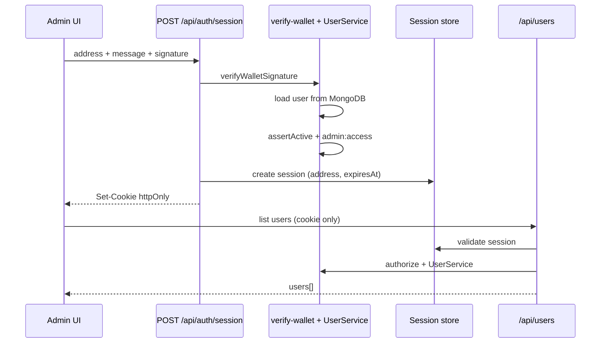

# Piano: sessione wallet per area admin

Implementazione incrementale di una **sessione server-side** derivata da una
firma wallet verificata, per ridurre i popup MetaMask nell'area admin senza
abbassare il livello di sicurezza. Ogni punto corrisponde a **un commit** (o a
una PR piccola).

Riferimenti:
- [users-management.md](./users-management.md) — dominio utenti, permessi, API
- [users-administration.md](./users-administration.md) — pannello `/admin/users` (già implementato)
- `apps/web/src/lib/auth/verify-wallet.ts` — challenge nonce monouso (stato attuale)

## Obiettivo

1. **Una firma wallet per sessione admin** invece di una firma per ogni richiesta
   API/action sull'area utenti.
2. **UX fluida** su `/admin/users`: caricamento lista, save e delete senza popup
   ripetuti finché la sessione è valida.
3. **Sicurezza invariata sul server**: identità e permessi sempre ricavati da
   documento `users` in MongoDB dopo verifica iniziale; nessuna fiducia nel solo
   `address` wagmi lato client.
4. **Compatibilità** con il flusso firma-per-richiesta esistente (fallback o
   migrazione graduale per authors e altre mutazioni).

**Fuori scope (v1):** SIWE formale (EIP-4361), sessioni multi-wallet, SSO,
refresh token rotation avanzata, sessioni per ruoli non-admin (author/reader).

---

## Problema attuale

### Due livelli di “login” confusi in UX

| Livello | Meccanismo | Quando |
| --- | --- | --- |
| **Connect** | wagmi `useAccount` | Click “Connect Wallet” |
| **Firma** | `createSignedWalletPayload` → `verifyWalletSignature` | Ogni API/action protetta |

L’utente admin percepisce la firma come un secondo login, soprattutto perché
**ogni operazione richiede un nuovo popup**.

### Perché ogni richiesta chiede una firma

In `verify-wallet.ts`:

- Challenge con nonce UUID e TTL **5 minuti**
- Dopo `verifyWalletSignature`, il nonce è marcato **`used: true`** (monouso)
- Store nonce in **`global.walletAuthNonceStore`** (Map in-memory, non adatto a
  Vercel serverless multi-istanza)

Flusso attuale su `/admin/users` (`UsersAdminPage.tsx`):

```
mount → firma → listUsersAction
save riga → firma → updateUserAction
delete → firma → deleteUserAction
```

Tre popup (o più) per una singola sessione di lavoro.

### RouteGuard e riconnessione wagmi

`RouteGuard` mostra “Connect your wallet” quando `isConnected === false`, senza
attendere `isReconnecting`. Al refresh di `/admin/users` può comparire un falso
prompt di connect anche con wallet già autorizzato in precedenza.

---

## Stato attuale vs target

| Aspetto | Oggi | Target |
| --- | --- | --- |
| Auth API `/api/users*` | Firma wallet obbligatoria per ogni richiesta | Sessione valida **oppure** firma wallet |
| Server Actions admin | Payload firmato su ogni action | Cookie sessione; firma solo per `establishSession` |
| Popup MetaMask su admin | 1+ per ogni operazione | 1 per sessione (o per TTL scaduto) |
| Store nonce/sessione | `Map` in-memory su `global` | Store persistente (Mongo o Redis/Upstash) |
| RouteGuard | Blocca se `!isConnected` | Attende reconnect; opzionale check sessione |
| Logout | Solo `disconnect()` wagmi | Disconnect + invalidazione sessione server |
| Authors / altre mutazioni | Firma per richiesta | Invariato in v1 (migrazione v2 opzionale) |

---

## Modello di sicurezza target

### Principio

> **Sign once, verify always server-side.**  
> La sessione è un attestato opaco emesso dal server **dopo** `verifyWalletSignature`
> e caricamento utente da DB. Il client non può forgiare permessi admin.

### Flusso sessione



### Cookie sessione

| Attributo | Valore |
| --- | --- |
| Nome | es. `andromeda_wallet_session` |
| `HttpOnly` | `true` |
| `Secure` | `true` in production |
| `SameSite` | `Lax` (o `Strict` se non rompe flussi) |
| `Path` | `/` |
| `Max-Age` | 900–1800 s (15–30 min); sliding opzionale v2 |

Il cookie contiene solo un **session ID** opaco (UUID). Payload firmato, ruolo e
permessi restano server-side nello store.

### Cosa resta obbligatorio server-side (invarianti)

- Caricamento `users` da MongoDB per ogni mutazione (ruolo/status correnti)
- `assertActive(signer)` su mutazioni
- `assertCanListUsers` / `assertCanWriteUser` / `assertCanDeleteUser`
- Zod su input; rate limiting
- Nessun leak di `MONGODB_URI`, stack trace, segreti sessione al client

### Cosa non fare

| Anti-pattern | Motivo |
| --- | --- |
| Riutilizzare la stessa firma/nonce per più richieste senza sessione | Replay |
| Salvare firma o private key in `localStorage` | XSS |
| Mettere `role: admin` nel cookie JWT firmato solo client-side | Tampering |
| Sessioni di giorni senza re-auth | Finestra di attacco ampia |
| Fidarsi di `wagmi.address` senza sessione/firma su API | Spoofing |

---

## Architettura a strati

```
apps/web/src/
  lib/
    auth/
      verify-wallet.ts          # invariato per challenge; store nonce → adapter
      wallet-session.ts         # create/validate/revoke session (dominio)
      wallet-session-store.ts # port SessionStore
      adapters/
        mongo-wallet-session-store.ts   # v1 (riusa MongoDB)
        # memory-wallet-session-store.ts  # test
      resolve-wallet-auth.ts    # session OR signature → signer address + User
    users/
      user-mutations.ts         # usa resolveWalletAuth invece di solo verify
  app/
    api/
      auth/
        message/route.ts        # invariato
        session/route.ts        # POST establish, DELETE revoke
        session/status/route.ts # GET opzionale per UI
    actions/
      wallet-session.ts         # establishSessionAction, revokeSessionAction
  components/
    admin/
      UsersAdminPage.tsx        # session-first; firma solo se 401/no session
    navigation/
      RouteGuard.tsx            # attende isReconnecting
```

### `resolveWalletAuth` (nuovo helper condiviso)

```ts
// Pseudocodice contratto
type ResolvedAuth =
  | { kind: "session"; user: User }
  | { kind: "signature"; user: User };

async function resolveWalletAuth(
  input: { headers: Headers } | { body: WalletAuthInput },
): Promise<ResolvedAuth>
```

Ordine di valutazione:

1. Cookie sessione valido → carica `User` da DB per `session.address`
2. Altrimenti firma wallet nel body/headers → `verifyWalletSignature` → carica `User`
3. Altrimenti `401 Unauthorized`

---

## Store sessione — scelta v1

### Opzione A — Collection MongoDB `wallet_sessions` (consigliata v1)

Pro: già presente MongoDB nel progetto; nessuna dipendenza nuova.  
Contro: TTL index da configurare; leggermente più lento di Redis.

```ts
{
  sessionId: string;      // UUID, unique
  address: string;        // lowercase
  createdAt: Date;
  expiresAt: Date;
  lastSeenAt: Date;
}
```

Indice TTL su `expiresAt`; indice su `sessionId`.

### Opzione B — Upstash Redis (v2)

Pro: TTL nativo, adatto a Vercel edge.  
Contro: nuova integrazione/env.

**Decisione v1:** MongoDB adapter, con port `WalletSessionStore` per swap futuro.

### Migrazione nonce store

Spostare anche i nonce di `verify-wallet.ts` da `global.Map` a MongoDB collection
`wallet_auth_nonces` (TTL 5 min), così challenge e sessione funzionano su
serverless multi-istanza. Step separato ma nella stessa epic.

---

## Esperienza utente target

### Flusso admin ideale

1. Utente connette wallet (come oggi).
2. Click “Manage users” → se nessuna sessione valida: **un** popup firma.
3. Server crea sessione → cookie impostato.
4. Tabella utenti si carica **senza** ulteriori firme.
5. Save/delete/create nella stessa visita: **senza** popup fino a scadenza sessione.
6. Logout wallet → revoca sessione (action o `DELETE /api/auth/session`).
7. Sessione scaduta → UI chiede una nuova firma (messaggio chiaro, non “login”).

### Messaggi UI

| Stato | Messaggio |
| --- | --- |
| Sessione assente | “Confirm in your wallet to authorize admin access.” |
| Sessione attiva | Nessun prompt |
| Sessione scaduta | “Your admin session expired. Please confirm again in your wallet.” |
| Reconnect wagmi | “Reconnecting wallet…” (non “Connect wallet”) |

### RouteGuard

```ts
const { isConnected, isReconnecting } = useAccount();

if (isReconnecting) {
  return <CheckingAccess />;
}

if (!isConnected && !hasValidSessionHint) {
  return <ConnectWallet />;
}
```

`hasValidSessionHint` opzionale via `GET /api/auth/session/status` leggero, o
inferenza dopo primo snapshot — da definire nello step 6.

---

## API e Server Actions

### Nuovi endpoint

| Metodo | Route | Auth | Comportamento |
| --- | --- | --- | --- |
| `POST` | `/api/auth/session` | Body: firma wallet | Verifica firma, controlla admin, crea sessione, `Set-Cookie` |
| `DELETE` | `/api/auth/session` | Cookie | Revoca sessione corrente |
| `GET` | `/api/auth/session/status` | Cookie opzionale | `{ active: boolean, expiresAt?: string }` — nessun dato sensibile |

### Server Actions

| Action | Uso |
| --- | --- |
| `establishWalletSessionAction(input)` | UI: una firma, imposta cookie via response |
| `revokeWalletSessionAction()` | Logout: invalida sessione |

**Nota Next.js:** le Server Actions possono leggere i cookie con `cookies()` da
`next/headers`. Per `Set-Cookie` su establish, usare route handler `POST
/api/auth/session` o `cookies().set` nell'action (App Router supportato).

### Adattamento actions admin

`users-admin.ts` — rimuovere obbligo di payload firmato quando cookie valido:

```ts
export async function listUsersAction(input?: unknown): Promise<User[]> {
  // resolveWalletAuth: cookie first, else parse listUsersActionSchema(input)
}
```

Retrocompatibilità: se arriva body firmato senza cookie, funziona come oggi.

---

## Step di implementazione

Ogni step è un commit (o PR piccola) con test associati.

| # | Step | File principali | Test |
| --- | --- | --- | --- |
| 1 | Port `WalletSessionStore` + modello dominio sessione | `wallet-session.ts`, `wallet-session-store.ts`, `testing/in-memory-*` | CRUD session in-memory |
| 2 | Adapter Mongo `wallet_sessions` + TTL index | `adapters/mongo-wallet-session-store.ts`, `db/models/wallet-session.model.ts` | integrazione memory-server |
| 3 | `resolveWalletAuth` (cookie OR signature) | `resolve-wallet-auth.ts` | unit con fake store + mock verify |
| 4 | `POST/DELETE /api/auth/session` + status | `app/api/auth/session/**` | API test con cookie jar |
| 5 | Migrare nonce store su Mongo (opzionale ma consigliato nello stesso sprint) | `verify-wallet.ts`, adapter nonce | verify-wallet + deploy smoke |
| 6 | Refactor `user-mutations.ts` su `resolveWalletAuth` | `user-mutations.ts` | `users-api.test.ts` aggiornati |
| 7 | Refactor `users-admin.ts` — session-first | `actions/users-admin.ts`, `UsersAdminPage.tsx` | `users-admin.test.ts` |
| 8 | `RouteGuard` — `isReconnecting` + copy UX | `RouteGuard.tsx` | component test |
| 9 | Logout revoca sessione | `SiteHeaderNav.tsx`, `revokeWalletSessionAction` | integration smoke |
| 10 | Documentazione env/deploy + `pnpm web:test:coverage` ≥ 80% | docs, `vitest.config.ts` | coverage verde |

### Dettaglio step 7 — `UsersAdminPage`

```ts
// Pseudocodice
async function ensureAdminSession(): Promise<void> {
  const status = await getWalletSessionStatusAction();
  if (status.active) return;

  const signed = await createSignedWalletPayload(address, signMessageAsync);
  await establishWalletSessionAction(signed);
}

async function loadUsers() {
  await ensureAdminSession();
  const users = await listUsersAction(); // no signed payload
}
```

Save/delete/create: stesso pattern — nessuna firma se sessione attiva.

---

## Sicurezza

| ID | Rischio | Mitigazione |
| --- | --- | --- |
| **WS-01** | Session hijack via XSS | Cookie `HttpOnly`; no firma in localStorage |
| **WS-02** | Session fixation | Nuovo sessionId dopo ogni establish; invalida precedente |
| **WS-03** | Utente demoted admin con sessione vecchia | Ogni request ricarica `User` da DB; revoca se permessi insufficienti |
| **WS-04** | Utente sospeso opera con sessione | `assertActive` su ogni mutazione |
| **WS-05** | CSRF su cookie session | `SameSite=Lax`; mutazioni via POST; valutare token CSRF v2 |
| **WS-06** | Store in-memory su Vercel | Mongo/Redis persistente |
| **WS-07** | Sessione troppo lunga | TTL 15–30 min; sliding window opzionale |

### Operazioni ad alto rischio (v2 opzionale)

Per v1 tutte le mutazioni admin restano sulla stessa sessione. In v2 si può
richiedere **re-firma** per:

- promozione a `admin`
- delete dell’ultimo admin
- modifica `permissions` espliciti

---

## Criteri di accettazione

- [ ] Admin con wallet connesso apre `/admin/users` con **al massimo una** firma per sessione.
- [ ] Lista + create + update + delete funzionano senza popup aggiuntivi finché la sessione è valida.
- [ ] Sessione scaduta → una nuova firma ripristina l’accesso; messaggio UX chiaro.
- [ ] Logout wallet invalida la sessione server-side.
- [ ] Reader/author non possono ottenere sessione admin (403 su establish).
- [ ] API `/api/users` accettano ancora firma diretta (retrocompatibilità test).
- [ ] RouteGuard non mostra “Connect wallet” durante `isReconnecting`.
- [ ] `pnpm web:test:coverage` ≥ 80% sulle aree `lib/auth/**` incluse.

---

## Test plan manuale

1. Admin connesso, nessuna sessione → apri “Manage users” → **1 firma** → tabella caricata.
2. Modifica role/status su 2 righe → save → **nessun** popup aggiuntivo.
3. Elimina utente test → **nessun** popup.
4. Attendi scadenza TTL (o abbassa TTL in dev) → reload → **1 firma** richiesta.
5. Logout → riapri `/admin/users` → nuova firma richiesta.
6. Reader connesso → `POST /api/auth/session` → 403.
7. DevTools Application → cookie `HttpOnly` presente; nessuna firma in localStorage.

---

## Fuori scope / step successivi

- Sessione per mutazioni autore (`authors`) — stesso pattern, PR separata
- SIWE (EIP-4361) e messaggi standardizzati
- Refresh token / rotating session IDs
- “Remember this device” con TTL esteso
- 2FA o hardware wallet policies

---

## Comandi utili (sviluppo)

```bash
pnpm web:test:coverage
pnpm dev
```

```javascript
// mongosh — sessioni attive (dopo implementazione)
db.wallet_sessions.find().pretty()
db.wallet_sessions.getIndexes()
```

Vedi [users-administration.md](./users-administration.md) per seed admin e test
del pannello utenti.
