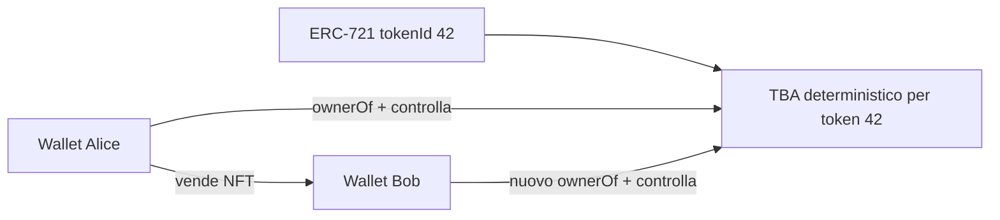
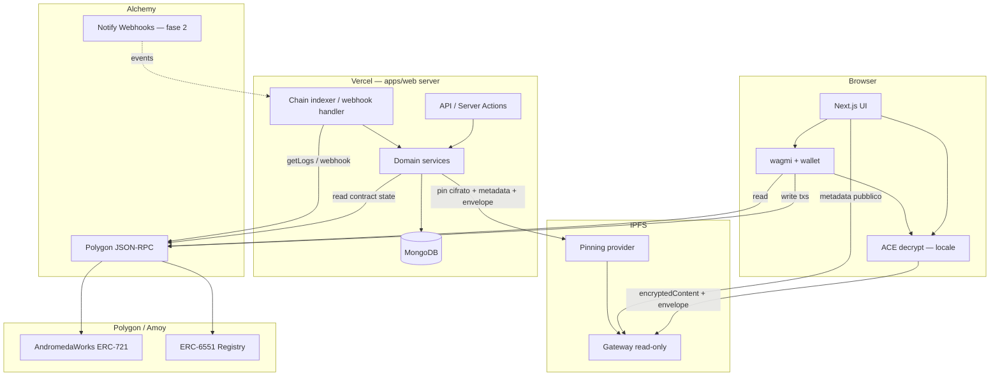
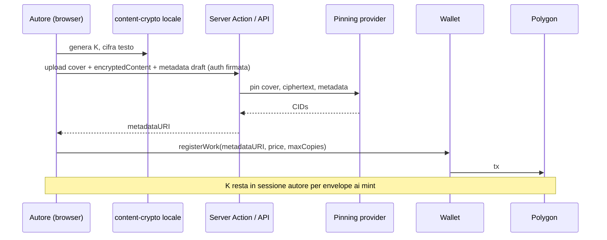
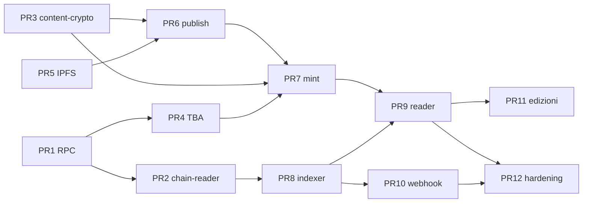

# Piano: architettura Web3 (blockchain + IPFS)

Definizione dell’infrastruttura software che collega `apps/web` alla rete Polygon, al contratto
`AndromedaWorks` e a IPFS. Il documento descrive **cosa costruire** e **come organizzarlo** nel
monorepo, in coerenza con il flusso descritto nel [README](../../README.md) e con i principi di
clean architecture già applicati al layer auth/DB.

**Provider RPC scelto:** [Alchemy](https://www.alchemy.com/) (Polygon mainnet + Polygon Amoy).
**Client library:** [viem](https://viem.sh/) (server) e [wagmi](https://wagmi.sh/) (browser).
**Storage decentralizzato:** IPFS con pinning gestito (es. Pinata o web3.storage).
**Accesso al testo:** paywall **tecnico** — metadata pubblico su IPFS, contenuto cifrato, envelope
per token tramite [ERC-6551](https://eips.ethereum.org/EIPS/eip-6551) (Token Bound Account).

---

## Decisioni di prodotto (vincolanti)

| Decisione | Scelta | Motivazione |
| --- | --- | --- |
| Paywall lettura | **Tecnico** (non solo UX) | Il testo non deve essere recuperabile da chiunque conosca il CID IPFS |
| Modello storage | **Metadata pubblico + contenuto cifrato** | OpenSea e wallet vedono titolo/cover; il testo resta protetto |
| Vincolo piattaforma | **Nessuno** per la lettura | Chiunque può implementare un client conforme allo standard ACE (vedi sotto) |
| Chiave di decifratura | **Envelope per token (ERC-6551 TBA)** | Il possessore corrente controlla un’identità legata al `tokenId`; funziona dopo rivendite su OpenSea senza re-wrap manuale |
| Gate server Andromeda | **Opzionale / UX** | La decifratura avviene **in browser**; il server non custodisce chiavi né streama testo in chiaro |

### Perché non altre strade (scartate)

- **Testo in chiaro su IPFS** — il CID nel metadata rende il contenuto pubblico via gateway; incompatible con il paywall tecnico.
- **Gate solo lato server** (`ownerOf` → proxy testo) — paywall applicativo; l’utente resta dipendente da Andromeda.
- **Envelope cifrato per EOA del compratore** — al primo acquisto funziona; alla rivendita il nuovo wallet non può decifrare senza cooperazione del venditore.
- **Lit Protocol / conditional access esterno** — valido, ma introduce dipendenza da una rete terza; ERC-6551 mantiene il modello “private key / identità token” puramente on-chain + IPFS.

---

## Obiettivo

Separare chiaramente tre responsabilità già descritte nel README:

| Layer | Responsabilità |
| --- | --- |
| **IPFS** | Testo cifrato dell’opera, metadata JSON pubblico (standard OpenSea), envelope chiave per token. |
| **Andromeda** (contratto + web app) | Certificazione autore, edizioni limitate, vendita primaria, esperienza di lettura, amministrazione. |
| **OpenSea** (opzionale) | Indicizzazione e mercato secondario — **non** il flusso di mint primario. |

Il layer Web3 in `apps/web` deve:

1. **Leggere e scrivere on-chain** tramite viem/wagmi, con RPC affidabile (Alchemy).
2. **Caricare su IPFS** contenuto cifrato e metadata pubblici prima di `registerWork` / `mintCopy`.
3. **Creare envelope per token** al mint, legati al TBA del `tokenId` (ERC-6551).
4. **Sincronizzare eventi chain → MongoDB** per catalogo, libreria utente e UX (non per autorizzare la decifratura).
5. **Non duplicare** la logica di auth wallet già presente (`verify-wallet.ts`, sessioni admin).
6. **Restare testabile** con port e fake in-memory, senza MongoDB né RPC reali nei test di dominio.
7. **Documentare ACE** (Andromeda Content Encryption) come specifica aperta per client terzi.

---

## Principi architetturali

### Dipendenze verso l’interno

```
UI (components)
    → Server Actions / Route Handlers (delivery)
        → Zod + auth (firma wallet / sessione admin)
            → domain services (works, library, publish)
                → ports (ChainReader, IpfsStorage, ContentCrypto, TbaRegistry)
                    → adapters (Alchemy RPC, Pinata, viem TBA, Mongo)
```

- Il **dominio** (`lib/works/*`, `lib/ipfs/*`, `lib/content-crypto/*`, `lib/tba/*`) non importa
  Alchemy SDK, Pinata SDK, `mongoose` o `wagmi`.
- **Alchemy** è un dettaglio infrastrutturale: un URL RPC iniettato in `createPublicClient` / `http()`.
- Le **transazioni on-chain** firmate dall’utente restano nel browser (wagmi); il server non custodisce
  chiavi private di autori o lettori.
- La **chiave simmetrica del testo** (`K`) esiste in chiaro solo transientemente nel browser dell’autore
  al publish e del lettore durante la decifratura locale — mai persistita server-side.

### Cosa resta on-chain vs off-chain

| Dato | Dove vive | Fonte di verità |
| --- | --- | --- |
| Autore certificato di un’opera | On-chain (`works[workId].author`) | Contratto |
| Prezzo, `maxCopies`, `minted`, stato vendita | On-chain | Contratto |
| Proprietà di una copia (token ERC-721) | On-chain (`ownerOf`) | Contratto |
| `metadataURI` registrato con l’opera | On-chain (stringa `ipfs://…`) | Contratto |
| Identità di decifratura del token | On-chain (TBA ERC-6551 per `tokenId`) | Registry ERC-6551 |
| Testo dell’opera (cifrato) | IPFS | CID + pinning provider |
| Metadata JSON pubblico (titolo, cover) | IPFS | CID referenziato on-chain |
| Envelope `Encrypt(K, TBA)` per token | IPFS | Un envelope per `tokenId` |
| Profilo autore (display name, avatar) | MongoDB | Già implementato (`authors`) |
| Catalogo indicizzato, libreria utente, stato sync | MongoDB | Proiezione eventi chain + dati UX |

La regola operativa: **ownership e certificazione** si verificano on-chain; **il testo è leggibile
solo decifrando localmente** con controllo del TBA del token posseduto. MongoDB non sostituisce
né l’ownership né la crittografia.

### Auth wallet vs interazione chain

Due flussi distinti che non vanno confusi:

| Flusso | Meccanismo | Uso |
| --- | --- | --- |
| **Auth piattaforma** | Firma EIP-191 di un messaggio con nonce (`verify-wallet.ts`) | Profilo autore, admin, preferenze, ruoli |
| **Transazione chain** | Firma EIP-1559 / legacy via wallet (`registerWork`, `mintCopy`, deploy TBA) | Certificazione opera, acquisto copia, setup envelope |
| **Decifratura contenuto** | Controllo TBA del `tokenId` + unwrap envelope in browser | Lettura opera — **indipendente** dalla sessione Andromeda |

Il server **non** sostituisce il wallet nelle transazioni che muovono MATIC o mintano NFT.

---

## Accesso al contenuto: ACE + ERC-6551

### Modello crittografico (ACE — Andromeda Content Encryption)

Tre artefatti distinti per ogni opera:

```
┌─────────────────────────────────────────────────────────────┐
│  1. encryptedContent   AES-256-GCM(K, plaintext)            │
│     Un blob per workId — stesso testo per tutte le copie    │
│     Pin IPFS — CID pubblico ma inutile senza K               │
├─────────────────────────────────────────────────────────────┤
│  2. metadata (pubblico)   JSON OpenSea-compatible           │
│     Titolo, cover, autore, encryption scheme, puntatori     │
│     NO chiavi, NO CID testo in chiaro                        │
├─────────────────────────────────────────────────────────────┤
│  3. envelope[tokenId]   ECIES( pubkey_TBA(tokenId), K )      │
│     Un envelope per copia mintata                           │
│     Pin IPFS — legato al token, non all’EOA del compratore    │
└─────────────────────────────────────────────────────────────┘
```

**Flusso di decifratura (qualsiasi client conforme ACE):**

1. Il lettore possiede `tokenId` (`ownerOf` sul wallet connesso).
2. Il client calcola o recupera l’indirizzo **TBA** deterministico per quel `tokenId`.
3. Il client verifica di poter **operare il TBA** (ownership NFT + firma via wallet o EIP-1271).
4. Il client scarica `envelope[tokenId]` da IPFS e fa **unwrap** con il TBA → ottiene `K`.
5. Il client scarica `encryptedContent` da IPFS e decifra **localmente** → testo.

### Perché ERC-6551 risolve il mercato secondario



- Il TBA è **deterministico** per `(chainId, contract, tokenId)` — non cambia alla rivendita.
- Cambia solo chi **controlla** il TBA (il nuovo `ownerOf` del NFT).
- L’envelope resta valido: Bob usa lo stesso TBA #42 con la sua wallet — **nessun re-wrap**, nessun intervento Andromeda.

### Standard aperto (indipendenza dalla piattaforma)

Andromeda pubblica e versiona la specifica **ACE** (campi metadata, algoritmi, layout IPFS, calcolo
indirizzo TBA, registry ERC-6551 usato). Un client terzo (script, app mobile, estensione) può:

- leggere `metadataURI` dalla chain;
- scaricare metadata e blob cifrato da IPFS via gateway;
- decifrare se il wallet dell’utente controlla il TBA del token.

Andromeda è il **primo reader**, non l’unico gatekeeper.

---

## Panoramica infrastrutturale



### Ruolo di Alchemy

Alchemy fornisce:

- **JSON-RPC** per `eth_call`, `eth_getLogs`, stima gas, lettura stato contratto, verifica `ownerOf`.
- **(Fase 2)** [Notify](https://docs.alchemy.com/reference/notify-api-quickstart) per webhook su
  eventi `WorkRegistered`, `CopyMinted`, `Transfer`.

Alchemy **non** sostituisce crittografia, TBA, pinning IPFS o la logica di dominio Andromeda.

**Implementazione:** viem `http(ALCHEMY_RPC_URL)` — nessun obbligo di `alchemy-sdk` nel core.

---

## Flusso end-to-end (pubblicazione, acquisto, lettura)

### Pubblicazione (autore)

```
Autore prepara testo + cover
        │
        ▼
Genera K (casuale, locale) → AES-256-GCM → encryptedContent
        │
        ▼
Pin encryptedContent su IPFS
        │
        ▼
Build metadata pubblico (titolo, cover, ace_version, encrypted_content CID)
        │  — senza K, senza testo in chiaro
        ▼
Pin metadata su IPFS
        │
        ▼
registerWork(metadataURI, price, maxCopies)   ← tx firmata autore (wagmi)
        │
        ▼
Indexer: WorkRegistered → upsert opera in MongoDB
```

`K` resta solo in memoria nel browser dell’autore fino al mint delle copie (vedi sotto). Il server
**non** salva `K`.

### Acquisto (lettore) e setup envelope

```
Lettore: mintCopy(workId) + pagamento MATIC   ← tx wagmi
        │
        ▼
Deploy TBA per tokenId (se non esiste)        ← tx wagmi, ERC-6551 registry
        │
        ▼
Crea envelope[tokenId] = ECIES(pubkey_TBA, K)
        │
        ▼
Pin envelope su IPFS
        │
        ▼
Indexer: CopyMinted + Transfer → tokens in MongoDB
```

**Nota implementativa sul mint:** l’autore (o un relayer open source documentato) deve poter creare
l’envelope al momento del mint. Opzioni:

1. **Autore online al mint** — il client autore conserva `K` in sessione fino a esaurimento copie
   (o in `sessionStorage` cifrato con firma autore); al `CopyMinted` crea l’envelope per il nuovo
   `tokenId`.
2. **K re-incapsulata per opera** — all’`registerWork`, l’autore pin anche
   `authorEnvelope = ECIES(pubkey_autore, K)` su IPFS (non nel metadata pubblico OpenSea); al mint,
   un client osserva l’evento, l’autore unwrap con la propria wallet, re-wrap per il TBA del token.
   Funziona senza Andromeda server, ma richiede che l’autore (o un bot con accesso alla sua key) partecipi.

La scelta tra (1) e (2) è un dettaglio UX da finalizzare nello step 6; entrambe rispettano ACE e
non vincolano alla piattaforma.

### Lettura (possessore — anche dopo rivendita)

```
Wallet possiede tokenId (ownerOf)
        │
        ▼
Client calcola TBA(tokenId) — verifica controllo
        │
        ▼
IPFS: scarica envelope[tokenId] → unwrap con TBA → K
        │
        ▼
IPFS: scarica encryptedContent → AES decrypt locale → testo
```

Nessuna chiamata obbligatoria ad Andromeda per decifrare.

### Eventi contratto da indicizzare

| Evento | Campi rilevanti | Azione indexer |
| --- | --- | --- |
| `WorkRegistered` | `workId`, `author`, `metadataURI`, `price`, `maxCopies` | Crea/aggiorna documento opera |
| `WorkStatusChanged` | `workId`, `active` | Aggiorna flag vendibilità |
| `CopyMinted` | `workId`, `tokenId`, `buyer` | Registra copia, `copyNumber`, `envelopeCid` |
| `Transfer` (ERC-721) | `from`, `to`, `tokenId` | Aggiorna `owner` in MongoDB (UX libreria) |

---

## Struttura moduli proposta

```
lib/
├── chain/
│   ├── types.ts
│   ├── rpc-config.ts
│   ├── public-client.ts
│   ├── contract.ts
│   ├── chain-reader.ts
│   ├── ports/chain-reader-port.ts
│   ├── adapters/viem-chain-reader.ts
│   └── testing/in-memory-chain-reader.ts
│
├── tba/
│   ├── types.ts
│   ├── tba-address.ts           # CREATE2 deterministico ERC-6551
│   ├── tba-registry.ts          # indirizzo registry Polygon/Amoy
│   ├── tba-operations.ts        # deploy account, verifica controllo
│   ├── ports/tba-port.ts
│   ├── adapters/viem-tba.ts
│   └── testing/in-memory-tba.ts
│
├── content-crypto/
│   ├── types.ts
│   ├── ace-spec.ts              # versione schema ACE, costanti algoritmo
│   ├── content-cipher.ts        # AES-256-GCM encrypt/decrypt
│   ├── envelope.ts              # ECIES wrap/unwrap K per pubkey TBA
│   ├── decrypt-workflow.ts      # orchestrazione pura: envelope + blob → plaintext
│   ├── ports/content-crypto-port.ts
│   └── testing/
│       ├── in-memory-content-crypto.ts
│       └── fixtures/            # K, ciphertext, envelope di test
│
├── ipfs/
│   ├── types.ts
│   ├── metadata-schema.ts       # Zod — OpenSea + campi ACE (no plaintext content)
│   ├── ports/ipfs-storage-port.ts
│   ├── adapters/pinata-ipfs-storage.ts
│   └── testing/in-memory-ipfs-storage.ts
│
├── works/
│   ├── types.ts
│   ├── publish-service.ts       # cifra → pin → metadata → pronto per registerWork
│   ├── mint-envelope-service.ts # post-mint: TBA + envelope
│   ├── library-service.ts       # libreria utente (proiezione MongoDB)
│   ├── ports/work-repository.ts
│   ├── adapters/mongo-work-repository.ts
│   └── testing/in-memory-work-repository.ts
│
├── indexer/
│   ├── chain-event-handler.ts
│   ├── sync-cursor.ts
│   └── testing/fixtures/
│
└── wagmi.ts
```

**Delivery** (sottili, senza logica business):

- `app/api/works/...` — catalogo pubblico, dettaglio opera (metadata pubblico only).
- `app/api/ipfs/upload` — upload cover e orchestrazione pin (auth autore, rate limit).
- `app/api/chain/webhook` — Alchemy Notify (fase 2).
- **Nessuna** route che restituisce testo in chiaro o `K` — la lettura è client-side.

---

## IPFS

### Asset da memorizzare

| Asset | Visibilità | Contenuto |
| --- | --- | --- |
| `encryptedContent` | CID noto da metadata, blob inutile senza `K` | Testo cifrato AES-256-GCM |
| `metadata` | Pubblico (referenziato on-chain) | Titolo, cover, attributi commerciali, `ace` |
| `envelope[tokenId]` | Pubblico | `Encrypt(K, pubkey_TBA)` — inutile senza controllo TBA |
| `cover` | Pubblico | Immagine copertina |

### Metadata pubblico (esempio ACE v1)

```json
{
  "name": "Short Story — Work #3",
  "description": "Author-certified literary work.",
  "image": "ipfs://…cover…",
  "external_url": "https://andromeda-bookstore.xyz/works/3",
  "attributes": [
    { "trait_type": "Author", "value": "Jane Doe" },
    { "trait_type": "Edition", "value": "100" }
  ],
  "ace": {
    "version": "1",
    "encrypted_content": "ipfs://…ciphertext…",
    "cipher": "aes-256-gcm",
    "envelope_scheme": "ecies-secp256k1",
    "tba_standard": "erc-6551",
    "chain_id": 137,
    "contract": "0x…AndromedaWorks…",
    "registry": "0x…ERC6551Registry…"
  }
}
```

**Non includere** nel metadata pubblico:

- CID o contenuto del testo in chiaro;
- chiave simmetrica `K`;
- endpoint esclusivi Andromeda per la decifratura.

Per le **edizioni numerate** (evoluzione), il metadata può diventare per-token; `encrypted_content`
resta condiviso per `workId`, mentre `envelope` resta per `tokenId`.

### Workflow upload (publish)



### Provider pinning

Pinata o web3.storage tramite `IpfsStoragePort`. Il dominio vede solo `pinJson`, `pinBlob`,
`toGatewayUrl`.

---

## Client vs server

### Browser (wagmi + ACE)

| Operazione | Strumento | Note |
| --- | --- | --- |
| Connessione wallet | wagmi | Già in `lib/wagmi.ts` |
| Cifratura al publish | `content-crypto` | `K` generata in browser |
| `registerWork` | `useWriteContract` | Autore paga gas |
| `mintCopy` | `useWriteContract` + `value` | Lettore paga prezzo + gas |
| Deploy TBA | `useWriteContract` su registry ERC-6551 | Dopo mint o in batch |
| Creazione envelope | `content-crypto` + `tba` | Pin envelope su IPFS |
| **Lettura / decifratura** | `decrypt-workflow` in browser | Scarica IPFS + unwrap TBA + AES locale |
| Firma auth piattaforma | `useSignMessage` | Profilo/admin — separato dalla lettura |

### Server (viem)

| Operazione | Strumento | Note |
| --- | --- | --- |
| Pin IPFS (cover, ciphertext, metadata) | `ipfs-storage` | Mai pin di `K` in chiaro |
| Lettura stato opera / `ownerOf` | `chain-reader` | Catalogo, UI libreria |
| Indicizzazione eventi | `getLogs` / webhook | Proiezione MongoDB |
| Verifica firma piattaforma | `verifyMessage` | Già implementato |
| **Stream testo in chiaro** | **Non previsto** | Decifratura solo client-side |

---

## Integrazione MongoDB

Collezioni (proiezione UX, **non** autorizzazione decifratura):

| Collezione | Contenuto | Chiave |
| --- | --- | --- |
| `works` | `workId`, `author`, `metadataURI`, `encryptedContentCid`, `price`, `maxCopies`, `minted`, `active` | `workId` |
| `tokens` | `tokenId`, `workId`, `owner`, `copyNumber`, `tbaAddress`, `envelopeCid` | `tokenId` |
| `chain_sync` | ultimo blocco processato | singleton |

---

## Sicurezza

| ID | Rischio | Mitigazione |
| --- | --- | --- |
| **W-01** | RPC / API key Alchemy esposta | Chiavi server in Vercel; app Alchemy separata client; rotazione |
| **W-02** | Testo in chiaro su IPFS | AES-256-GCM; solo ciphertext pinato; metadata senza plaintext |
| **W-03** | Upload IPFS anonimo | Auth firma wallet autore + rate limiting |
| **W-04** | Webhook indexer spoofato | Verifica firma Alchemy Notify; idempotenza |
| **W-05** | Metadata malevolo (XSS) | Zod + sanitizzazione; CSP |
| **W-06** | Replay sync eventi | Unique index `(txHash, logIndex)` |
| **W-07** | Leak errori RPC | Messaggi generici al client |
| **W-08** | Envelope legato a EOA acquisto | **ERC-6551 TBA** per token — envelope stabile alle rivendite |
| **W-09** | `K` persistita server-side | Vietato; `K` solo transient in browser |
| **W-10** | Lettore senza envelope post-mint | Flow mint deve completare deploy TBA + pin envelope; retry idempotente |

---

## Variabili d’ambiente

### `apps/web` (Next.js)

| Variabile | Scope | Uso |
| --- | --- | --- |
| `ALCHEMY_RPC_URL` | Server only | `createPublicClient`, indexer |
| `NEXT_PUBLIC_ALCHEMY_RPC_URL` | Client | wagmi transport |
| `NEXT_PUBLIC_CHAIN` | Client | `polygon` \| `polygonAmoy` |
| `NEXT_PUBLIC_CONTRACT_ADDRESS` | Client | `AndromedaWorks` |
| `NEXT_PUBLIC_ERC6551_REGISTRY` | Client | Calcolo e deploy TBA |
| `NEXT_PUBLIC_ERC6551_IMPLEMENTATION` | Client | Account implementation TBA |
| `IPFS_PINNING_API_KEY` | Server only | Pinning |
| `IPFS_GATEWAY_BASE_URL` | Client / server | Fetch metadata e blob cifrati |
| `CHAIN_INDEXER_ENABLED` | Server | Indexer on/off |
| `ALCHEMY_NOTIFY_SIGNING_KEY` | Server | Webhook (fase 2) |

### `packages/contracts` (Hardhat)

| Variabile | Uso |
| --- | --- |
| `AMOY_RPC_URL` | Deploy/test — URL Alchemy |
| `POLYGON_RPC_URL` | Deploy mainnet |
| `PRIVATE_KEY` | Deployer |
| `POLYGONSCAN_API_KEY` | Verifica contratto |

---

## OpenSea e mercato secondario

- Metadata pubblico su IPFS → OpenSea indicizza titolo, cover, attributi.
- Il testo cifrato **non** è leggibile da OpenSea (né da gateway IPFS senza `K`).
- Dopo rivendita su OpenSea, il nuovo owner controlla lo stesso TBA → decifra con client ACE conforme.
- Andromeda aggiorna `tokens.owner` via indexer solo per UX libreria.

---

## Edizioni numerate (evoluzione)

- `encryptedContent`: invariato per `workId` (stesso testo).
- `metadata` per token: attributi `Copy #n/N` visibili su OpenSea.
- `envelope[tokenId]`: invariato nel modello (uno per token).
- Eventuale estensione contratto: `tokenURI` per token con metadata JSON dedicato.

---

## Testing

| Layer | Strategia |
| --- | --- |
| `content-cipher` / `envelope` | Round-trip encrypt/decrypt con chiavi fixture |
| `tba-address` | Indirizzi deterministici vs vector ERC-6551 noti |
| `decrypt-workflow` | Fake TBA + envelope + ciphertext → plaintext |
| `chain-reader` | Fake in-memory `ownerOf`, `getWork` |
| `ipfs-storage` | CID deterministici |
| `publish-service` / `mint-envelope-service` | Port fake, no RPC/IPFS reali |
| `chain-event-handler` | Log fixture da Hardhat |

---

## Piano di implementazione

Implementazione incrementale del layer Web3 in `apps/web` (e dove indicato in `packages/contracts`).
Ogni **step = una PR**; ogni **sotto-step = un commit** nella PR.

Convenzione messaggi commit: `feat(web): …`, `feat(contracts): …`, `test(web): …`, `docs: …`.

**Fuori scope di questo piano:** Lit Protocol, proxy server che streama testo in chiaro, envelope per
EOA acquirente, subgraph The Graph, nodo Polygon self-hosted, gas sponsorship.

### Mappa PR e dipendenze



| PR | Titolo | PR precedenti |
| --- | --- | --- |
| 1 | Infrastruttura RPC Alchemy | — |
| 2 | Chain reader e ABI contratto | 1 |
| 3 | Content crypto e ACE v1 | — |
| 4 | Token Bound Accounts (ERC-6551) | 1 |
| 5 | IPFS storage e metadata schema | — |
| 6 | Flusso publish autore | 2, 3, 5 |
| 7 | Flusso mint, TBA e envelope | 3, 4, 6 |
| 8 | Indexer eventi e collezioni MongoDB | 2 |
| 9 | Catalogo, libreria e reader client-side | 7, 8 |
| 10 | Alchemy Notify (webhook indexer) | 8 |
| 11 | Edizioni numerate (metadata per token) | 9 |
| 12 | Hardening e documentazione ACE pubblica | 9, 10 |

---

### PR 1 — Infrastruttura RPC Alchemy

**Obiettivo:** endpoint RPC affidabili per client e server; base per letture on-chain e wagmi.

**Stato implementazione:** ✅ completata su branch `web3-pr1-alchemy-rpc`.

#### Commit 1 — Variabili d'ambiente e documentazione locale ✅

`chore(web): add Alchemy RPC env vars to examples`

- Aggiungere `ALCHEMY_RPC_URL`, `NEXT_PUBLIC_ALCHEMY_RPC_URL` a `apps/web/.env.example`.
- Aggiornare `.env.development` / `.env.production` con placeholder commentati (nessun secret).
- Documentare in README (tabella env) le nuove variabili.

#### Commit 2 — Configurazione RPC server-side ✅

`feat(web): add chain RPC config for Alchemy`

- `lib/chain/rpc-config.ts`: `getServerAlchemyRpcUrl()`, `getPublicAlchemyRpcUrl()`, `getTargetChain()`.
- Validazione: errore esplicito se URL mancante quando invocato (non a import time).
- Test unitari su parsing chain e fallback env.

#### Commit 3 — Public client factory ✅

`feat(web): add viem public client factory`

- `lib/chain/public-client.ts`: `createAndromedaPublicClient()` con `http(getServerAlchemyRpcUrl())`.
- Modulo `server-only` dove appropriato.
- Test con transport mockato o URL fixture.

#### Commit 4 — Wagmi transport Alchemy ✅

`feat(web): wire wagmi transports to Alchemy RPC`

- Aggiornare `lib/wagmi.ts`: `http(getPublicAlchemyRpcUrl())` per Polygon e Amoy.
- Nessun cambiamento ai connettori wallet esistenti.

**Definition of done (PR 1):** dev e build ok; wagmi usa Alchemy; server può creare `PublicClient`; test verdi.

---

### PR 2 — Chain reader e ABI contratto

**Obiettivo:** letture tipizzate di `AndromedaWorks` dietro port testabile.

**Dipende da:** PR 1.

#### Commit 1 — ABI e indirizzo contratto

`feat(web): import full AndromedaWorks ABI from contract artifacts`

- Script o import da `packages/contracts/artifacts` in `lib/chain/contract.ts`.
- Sostituire l’ABI minimale in `lib/contract.ts` (re-export o deprecazione).
- Tipi `Abi` viem; `getContractAddress()` invariato.

#### Commit 2 — Tipi dominio chain

`feat(web): add on-chain work and token domain types`

- `lib/chain/types.ts`: `WorkOnChain`, `TokenOwner`, errori dominio (`WorkNotFoundError`, …).
- Allineamento ai campi del contratto (`author`, `metadataURI`, `price`, `maxCopies`, `minted`, `active`).

#### Commit 3 — Port e funzioni pure chain-reader

`feat(web): add chain reader port and pure read helpers`

- `lib/chain/ports/chain-reader-port.ts`: `getWork`, `getTotalWorks`, `ownerOf`, `workOfToken`.
- `lib/chain/chain-reader.ts`: funzioni pure che mappano risposte contratto → tipi dominio.

#### Commit 4 — Adapter viem

`feat(web): add viem chain reader adapter`

- `lib/chain/adapters/viem-chain-reader.ts`: implementazione port con `readContract`.
- Factory `createViemChainReader(publicClient)`.

#### Commit 5 — Fake in-memory e test

`test(web): add in-memory chain reader fake and unit tests`

- `lib/chain/testing/in-memory-chain-reader.ts`.
- Test: `getWork` esistente/non esistente, `ownerOf`, normalizzazione address.

**Definition of done (PR 2):** dominio legge stato contratto senza wagmi; coverage su chain-reader; zero MongoDB.

---

### PR 3 — Content crypto e ACE v1

**Obiettivo:** cifratura contenuto, envelope per TBA, specifica ACE interna al codice.

**Indipendente** da PR 1–2 (può procedere in parallelo).

#### Commit 1 — Specifica ACE e tipi

`feat(web): add ACE v1 spec constants and types`

- `lib/content-crypto/ace-spec.ts`: versione `"1"`, algoritmi (`aes-256-gcm`, `ecies-secp256k1`).
- `lib/content-crypto/types.ts`: `ContentKey`, `Ciphertext`, `Envelope`, `AceMetadataBlock`.

#### Commit 2 — Cifratura contenuto AES-256-GCM

`feat(web): add AES-256-GCM content cipher`

- `lib/content-crypto/content-cipher.ts`: `encryptContent`, `decryptContent` (Web Crypto o `@noble/ciphers`).
- IV random per blob; formato ciphertext versionato (prefix bytes + iv + tag + data).
- Test round-trip e tamper detection (tag invalido).

#### Commit 3 — Envelope ECIES per TBA

`feat(web): add ECIES envelope wrap and unwrap for TBA keys`

- `lib/content-crypto/envelope.ts`: `wrapContentKey`, `unwrapContentKey`.
- Input: `ContentKey` + pubkey secp256k1 del TBA; output: blob envelope portabile.
- Test con coppie chiavi fixture.

#### Commit 4 — Workflow decifratura

`feat(web): add decrypt workflow orchestration`

- `lib/content-crypto/decrypt-workflow.ts`: `decryptWorkContent({ ciphertext, envelope, tbaSigner })`.
- Funzione pura orchestrabile da UI; nessun fetch IPFS qui.
- Test end-to-end con fake signer.

**Definition of done (PR 3):** round-trip encrypt → wrap → unwrap → decrypt; nessun secret hardcoded; test ≥80% sul modulo.

---

### PR 4 — Token Bound Accounts (ERC-6551)

**Obiettivo:** calcolo indirizzo TBA, config registry, helper deploy.

**Dipende da:** PR 1.

#### Commit 1 — Config registry e env pubblici

`feat(web): add ERC-6551 registry config`

- `lib/tba/tba-registry.ts`: indirizzi registry e implementation per Polygon/Amoy.
- Env: `NEXT_PUBLIC_ERC6551_REGISTRY`, `NEXT_PUBLIC_ERC6551_IMPLEMENTATION`.
- Aggiornare `.env.example`.

#### Commit 2 — Indirizzo TBA deterministico

`feat(web): add deterministic ERC-6551 token bound account address`

- `lib/tba/tba-address.ts`: `getTbaAddress({ chainId, tokenContract, tokenId, registry, implementation })`.
- Test vs vector noti EIP-6551 (reference implementation).

#### Commit 3 — Port e operazioni TBA

`feat(web): add TBA port and control verification helpers`

- `lib/tba/ports/tba-port.ts`: `getAddress`, `isDeployed`, `createDeployTransaction`.
- `lib/tba/tba-operations.ts`: verifica che `ownerOf(tokenId)` corrisponda al wallet connesso.

#### Commit 4 — Adapter viem e fake

`feat(web): add viem TBA adapter and in-memory fake`

- `lib/tba/adapters/viem-tba.ts`: lettura bytecode/deploy via public client.
- `lib/tba/testing/in-memory-tba.ts` per test senza chain.
- Test unitari su address e guard di controllo.

**Definition of done (PR 4):** indirizzo TBA deterministico testato; helper deploy pronti per PR 7.

---

### PR 5 — IPFS storage e metadata schema

**Obiettivo:** pinning dietro port; schema metadata pubblico ACE senza testo in chiaro.

**Indipendente** da PR 1–4 (parallelo).

#### Commit 1 — Port IPFS

`feat(web): add IPFS storage port`

- `lib/ipfs/types.ts`: `Cid`, `PinResult`, `IpfsUri`.
- `lib/ipfs/ports/ipfs-storage-port.ts`: `pinBlob`, `pinJson`, `toGatewayUrl`.

#### Commit 2 — Schema metadata ACE (Zod)

`feat(web): add ACE public metadata Zod schema`

- `lib/ipfs/metadata-schema.ts`: validazione campi OpenSea + blocco `ace` (no plaintext content).
- Test: metadata valido, rifiuto CID testo in chiaro in `attributes`, rifiuto chiavi in JSON.

#### Commit 3 — Adapter in-memory

`feat(web): add in-memory IPFS storage fake`

- `lib/ipfs/testing/in-memory-ipfs-storage.ts`: CID deterministici da hash contenuto.
- Test adapter.

#### Commit 4 — Adapter Pinata

`feat(web): add Pinata IPFS storage adapter`

- `lib/ipfs/adapters/pinata-ipfs-storage.ts`: implementazione HTTP Pinata.
- Env `IPFS_PINNING_API_KEY`; errore generico al client se pin fallisce.
- Test con `fetch` mockato.

**Definition of done (PR 5):** pin JSON/blob dietro port; schema rifiuta metadata insicuri; nessuna chiave Pinata nel client.

---

### PR 6 — Flusso publish autore

**Obiettivo:** autore cifra, pin su IPFS, registra opera on-chain.

**Dipende da:** PR 2, PR 3, PR 5.

#### Commit 1 — Publish service (dominio)

`feat(web): add work publish service`

- `lib/works/publish-service.ts`: orchestrazione `encrypt → pin ciphertext → build metadata → pin metadata`.
- `K` mai passata al server; il server riceve solo ciphertext e metadata già cifrato/prodotto.
- Test con port fake (`content-crypto`, `ipfs`).

#### Commit 2 — API upload autenticata

`feat(web): add authenticated IPFS upload API for work publish`

- `app/api/works/upload/route.ts` (o sotto-route): auth firma autore + rate limit.
- Zod su dimensioni file e MIME; nessun campo `contentKey` accettato server-side.
- Test route con mock service.

#### Commit 3 — UI upload e preview

`feat(web): add author work upload and metadata preview UI`

- Componenti: upload testo + cover, anteprima metadata ACE, stato pin.
- Pagina o sezione in area autore (`/author/.../publish` o simile).
- Logica estratta in hook/helper testabili.

#### Commit 4 — Integrazione registerWork

`feat(web): wire registerWork transaction to publish flow`

- Wagmi `useWriteContract` per `registerWork(metadataURI, price, maxCopies)`.
- `metadataURI` = CID metadata pinato; feedback tx / errori generici.
- Conservare `K` in sessione autore (memoria/sessionStorage) per PR 7 — documentato in commento.

**Definition of done (PR 6):** autore completa publish su Amoy testnet; opera visibile on-chain; testo non in chiaro su IPFS.

---

### PR 7 — Flusso mint, TBA e envelope

**Obiettivo:** lettore acquista copia; TBA deployato; envelope per `tokenId` pinato.

**Dipende da:** PR 3, PR 4, PR 6.

#### Commit 1 — Mint envelope service

`feat(web): add mint envelope service for token-bound content keys`

- `lib/works/mint-envelope-service.ts`: post-mint, `wrapContentKey` per pubkey TBA + pin envelope.
- Strategia v1: `K` dalla sessione autore o unwrap da `authorEnvelope` (scegliere e implementare una).
- Test con fake `ipfs`, `tba`, `content-crypto`.

#### Commit 2 — Deploy TBA post-mint

`feat(web): add TBA deploy step after mintCopy`

- Helper client: dopo `CopyMinted`, tx deploy TBA se `bytecode` assente.
- Integrazione wagmi; gas stimato via public client.

#### Commit 3 — UI acquisto copia

`feat(web): add mint copy UI with price and sold-out state`

- Lettura `getWork` per prezzo e disponibilità; pulsante `mintCopy` con `value`.
- Stati: connecting, confirming, deploying TBA, pinning envelope, success/error.

#### Commit 4 — Completamento envelope e persistenza CID

`feat(web): pin per-token envelope and link to work copy`

- Pin `envelope[tokenId]`; esporre `envelopeCid` per indexer (evento custom log o metadato in MongoDB in PR 8).
- Idempotenza: non ripinare envelope se già esistente per `tokenId`.

#### Commit 5 — Test integrazione flusso mint

`test(web): add mint envelope service integration tests`

- Scenario: mint → TBA address → envelope → unwrap → decrypt con fake ports.

**Definition of done (PR 7):** acquisto end-to-end su Amoy; envelope su IPFS; TBA deployato; decrypt possibile con ACE client.

---

### PR 8 — Indexer eventi e collezioni MongoDB

**Obiettivo:** proiezione `works` / `tokens` da eventi chain per catalogo e libreria UX.

**Dipende da:** PR 2.

#### Commit 1 — Modelli Mongoose

`feat(web): add Mongoose models for works tokens and chain sync`

- `lib/db/models/work.model.ts`, `token.model.ts`, `chain-sync.model.ts`.
- Indici: unique `workId`, unique `tokenId`, index `tokens.owner`.

#### Commit 2 — Work repository

`feat(web): add work repository port and Mongo adapter`

- `lib/works/ports/work-repository.ts`, `adapters/mongo-work-repository.ts`.
- `lib/works/types.ts`: tipi dominio off-chain.
- Test con `mongodb-memory-server`.

#### Commit 3 — Chain event handler

`feat(web): add chain event handler for AndromedaWorks logs`

- `lib/indexer/chain-event-handler.ts`: decode `WorkRegistered`, `CopyMinted`, `WorkStatusChanged`, `Transfer`.
- Handler idempotente (`txHash` + `logIndex`).
- Test con log fixture da Hardhat.

#### Commit 4 — Sync cursor e job polling dev

`feat(web): add chain sync cursor and dev polling entrypoint`

- `lib/indexer/sync-cursor.ts`; script `scripts/sync-chain-events.ts` o route cron protetta.
- Env `CHAIN_INDEXER_ENABLED`.
- Polling via Alchemy `getLogs` da ultimo blocco salvato.

**Definition of done (PR 8):** eventi testnet indicizzati in MongoDB; re-run idempotente; test handler verdi.

---

### PR 9 — Catalogo, libreria e reader client-side

**Obiettivo:** UX lettura senza endpoint plaintext; decifratura nel browser.

**Dipende da:** PR 7, PR 8.

#### Commit 1 — API catalogo (solo dati pubblici)

`feat(web): add public works catalog API`

- `app/api/works/route.ts`, `app/api/works/[workId]/route.ts`.
- Risposta: metadata pubblico, prezzo, copie mintate — **no** ciphertext, **no** `K`.
- Test route.

#### Commit 2 — Pagine catalogo e dettaglio opera

`feat(web): add works catalog and work detail pages`

- `/works` lista; `/works/[workId]` dettaglio con CTA acquisto.
- Dati da API o Server Component + repository.

#### Commit 3 — Libreria utente

`feat(web): add reader library page from indexed tokens`

- `/library`: token posseduti dal wallet connesso (`tokens.owner` + verifica `ownerOf` opzionale).
- Link a reader per ogni copia.

#### Commit 4 — Reader client-side ACE

`feat(web): add client-side ACE reader for encrypted work content`

- `lib/content-crypto/reader-client.ts` (o componente `WorkReader`): fetch gateway IPFS → unwrap TBA → decrypt.
- Pagina `/read/[tokenId]`; verifica `ownerOf` prima di mostrare UI decifratura.
- **Nessuna** API server che restituisce plaintext.

#### Commit 5 — Test reader e stati UI

`test(web): add work reader helpers and loading state tests`

- Test logica estratta (non E2E wallet): possessore sì/no, envelope mancante, decrypt ok/ko.

**Definition of done (PR 9):** possessore legge in app senza server plaintext; non-possessore non vede testo; catalogo pubblico ok.

---

### PR 10 — Alchemy Notify (webhook indexer)

**Obiettivo:** indexer event-driven in produzione al posto del solo polling.

**Dipende da:** PR 8.

#### Commit 1 — Route webhook e verifica firma

`feat(web): add Alchemy Notify webhook endpoint with signature verification`

- `app/api/chain/webhook/route.ts`; env `ALCHEMY_NOTIFY_SIGNING_KEY`.
- Rifiuto richieste non firmate (`401`).

#### Commit 2 — Integrazione handler

`feat(web): wire Alchemy webhook payloads to chain event handler`

- Parsing payload Notify → log hex → `chain-event-handler`.
- Risposta rapida `200`; elaborazione idempotente.

#### Commit 3 — Test webhook

`test(web): add webhook signature and payload handler tests`

- Fixture payload Alchemy; firma valida/invalida; idempotenza doppio delivery.

**Definition of done (PR 10):** eventi produzione indicizzati via webhook; polling resta fallback dev.

---

### PR 11 — Edizioni numerate (metadata per token)

**Obiettivo:** attributi Copy #n/N su OpenSea e in UI; metadata per `tokenId`.

**Dipende da:** PR 9.

#### Commit 1 — Estensione contratto tokenURI (se necessaria)

`feat(contracts): set per-token URI on mintCopy for numbered editions`

- Modifica `AndromedaWorks.sol`: `mintCopy` imposta `tokenURI` distinto (parametro o template).
- Test Hardhat; redeploy solo testnet in documentazione.

#### Commit 2 — Generazione metadata per token al mint

`feat(web): generate per-token ACE metadata with copy number`

- Estensione `mint-envelope-service`: JSON per token con `Copy #n/N`.
- Pin metadata token; aggiornamento indexer `tokens.metadataURI`.

#### Commit 3 — UI edizione numerata

`feat(web): show copy number on library and reader pages`

- Visualizzazione `copyNumber` / `maxCopies` in libreria e reader.

**Definition of done (PR 11):** OpenSea/wallet mostrano numero copia; modello ACE invariato per ciphertext ed envelope.

---

### PR 12 — Hardening e documentazione ACE pubblica

**Obiettivo:** specifica aperta per client terzi, env produzione, robustezza operativa.

**Dipende da:** PR 9, PR 10.

#### Commit 1 — Specifica ACE pubblica

`docs: add ACE v1 specification for third-party readers`

- `documentation/ace-v1.md`: algoritmi, layout IPFS, calcolo TBA, flusso decrypt, esempi hex/CID.
- Link da README e da questo piano.

#### Commit 2 — Env Vercel e README

`docs: document web3 production env and architecture links`

- README: sezione Web3, link a `web3-layer-architecture.md` e `ace-v1.md`.
- Checklist variabili Vercel (Alchemy, Pinata, ERC-6551, contract address).

#### Commit 3 — Coverage e vitest include

`test(web): extend vitest coverage for chain crypto and indexer modules`

- Aggiornare `vitest.config.ts` `coverage.include` per `lib/chain`, `lib/content-crypto`, `lib/tba`, `lib/ipfs`, `lib/works`, `lib/indexer`.
- `pnpm web:test:coverage` ≥ 80% sulle aree incluse.

#### Commit 4 — Logging e messaggi errore RPC/IPFS

`feat(web): add safe server logging for chain and IPFS failures`

- Log strutturati server-side; messaggi client generici; nessun leak API key o stack.

**Definition of done (PR 12):** terza parte può implementare reader da documentazione; CI coverage verde; produzione documentata.

---

### Ordine di merge suggerito

Per ridurre conflitti e sbloccare il team, il merge lineare consigliato è:

**PR 1 → PR 2 ∥ PR 3 ∥ PR 4 ∥ PR 5** (fondazioni in parallelo dopo PR 1) → **PR 6** → **PR 7** e **PR 8** (parallelo) → **PR 9** → **PR 10** ∥ **PR 11** → **PR 12**.

Ogni PR deve essere **auto-contenuta**: test verdi, nessun secret committato, mutazioni auth invariate salvo nuove route documentate.

---

## Riferimenti

| Risorsa | Path / link |
| --- | --- |
| Contratto ERC-721 | `packages/contracts/contracts/AndromedaWorks.sol` |
| wagmi | `apps/web/src/lib/wagmi.ts` |
| Auth firma | `apps/web/src/lib/auth/verify-wallet.ts` |
| Flusso prodotto | [README.md](../../README.md) |
| ERC-6551 | [EIP-6551](https://eips.ethereum.org/EIPS/eip-6551) |
| Persistenza piattaforma | [db-integration.md](./db-integration.md) |

---

## Criteri di accettazione (layer Web3 v1)

1. Autore pubblica opera: testo cifrato e metadata pubblico su IPFS; `registerWork` on-chain.
2. Lettore acquista con `mintCopy`; TBA deployato; envelope per `tokenId` su IPFS.
3. Possessore decifra il testo **in browser** senza endpoint Andromeda che restituisce plaintext o `K`.
4. Dopo rivendita del NFT, il **nuovo** owner decifra con lo stesso flusso TBA (mercato secondario).
5. Metadata pubblico **non** contiene testo in chiaro né chiavi.
6. Specifica ACE documentata per implementazione client terzi.
7. RPC produzione via Alchemy; test unitari su crypto, TBA, chain-reader, indexer con fake in-memory.
8. Indexer idempotente su eventi chain.
